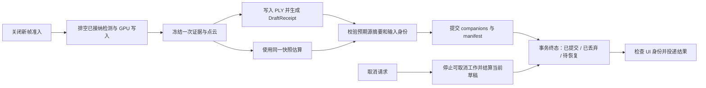

# FruitTreeScanner 重新判读与下一步重构方案

后续实施见 [重构迭代执行记录](REFACTOR_ITERATIONS_2026-09-27.md)。下文的故障与复现补丁对应评审时快照；补丁为历史证据，不应重复应用到已经纳入正式回归测试的后续实现。

日期：2026-09-27。检查对象：`codex/scan-architecture-refactor` 的当前工作区，HEAD 为 `81f49a6ec3d5`，包含尚未提交的架构迁移。

本轮重新读取生产代码、未提交差异、已有实施记录并运行定向 XCTest。旧蓝图用于对照目标，实施记录不代替当前验证。本文提出下一步实施范围，尚未修复以下问题，也未提交或推送。

## 1. 先处理两项已复现的问题

### P1：首次提交没有绑定估算所用的源点云身份

证据入口：

- [ScanRepository.swift:57](../../FruitTreeScanner/Infrastructure/Persistence/ScanRepository.swift#L57)：DraftScan 只持有 URL。
- [ScanRepository.swift:219](../../FruitTreeScanner/Infrastructure/Persistence/ScanRepository.swift#L219)：commit 只检查文件名相符，然后调用导出服务。
- [ScanResultExportService.swift:153](../../FruitTreeScanner/Core/ScanResultExportService.swift#L153)：首次提交没有旧 manifest，源摘要从提交当时的文件计算。
- [ScanFinalizationWorkflow.swift:349](../../FruitTreeScanner/Application/ScanFinalizationWorkflow.swift#L349)：估算结束后才重新根据路径构造 draft，没有携带 PLY 写入时的凭证。

**复现场景：** 暂存合法 PLY A → 准备 A 的估算结果 → 在第一次提交前将同一路径替换为合法 PLY B → commit。新增断言预期拒绝，实际没有抛错，提交确认成功。

这意味着 manifest 的摘要可以正确对应 B，但 metadata 中的果数/产量来自 A。已有“提交过程中源改变”和“已提交 revision 被替换”测试没有覆盖这一时间窗口。文件完整性不能独自证明结果和源数据的对应关系。

**需要的修复：** 暂存完成时产生带摘要和输入身份的凭证；估算与提交持有同一凭证；提交的前置条件是源仍匹配该凭证。不能到 commit 开始时才补算“预期摘要”，否则窗口仍然存在。

### P2：取消之后的保存失败没有结算未提交草稿

证据入口：

- [ScanFinalizationWorkflow.swift:200](../../FruitTreeScanner/Application/ScanFinalizationWorkflow.swift#L200)：cancel 清除 WorkID，保存进行中时跳过 discard。
- [ScanFinalizationWorkflow.swift:295](../../FruitTreeScanner/Application/ScanFinalizationWorkflow.swift#L295)：保存任务的成功/失败分支都先验证 WorkID；取消后直接返回。
- [ScanReadinessTests.swift:2626](../../FruitTreeScannerTests/ScanReadinessTests.swift#L2626)：已有竞争测试覆盖保存已经成功的情况，要求保留记录。

**复现场景：** PLY 已写入 → 保存挂起 → 用户取消 → 保存抛出写入错误。新增断言预期结算该未提交草稿，实际 discard 调用集合为空。此项为可控 workflow 替身的行为复现，未对真实用户目录注入故障。

旧页面状态应拒绝迟到回调，但仓储事务仍需要收尾。两者目前使用同一 WorkID guard，导致终态通知与文件收尾一起被跳过。后果是取消后可能留下未完成 PLY，且流程没有反馈清理结果。

**需要的修复：** 将事务结算与 UI 投递分开。仓储先确定结果是已提交、未提交可丢弃、还是状态不明需恢复；旧 UI 只拒绝展示事件。禁止在 catch 中不加判断地删除文件，因为失败也可能发生在提交后确认阶段。

## 2. 当前架构的重新评价

结论：**第一轮职责提取已有实际收益，下一步应补齐数据身份、任务终态和依赖契约。** 当前版本应判为 `needs changes`；P1 修复前不应合并为已完成验收的架构迁移。

本轮初始统计为 54 个已跟踪路径发生改动、10 个未跟踪文件；App Swift 为 259 个文件、47,419 行。与原基线相比净增加 1,511 行。这只是含空行/注释的规模变化；新增测试与完整性规则有价值，不能用删行替代复杂度判断。

| 已有改变 | 本次判断 | 下一步边界 |
|---|---|---|
| ScanPlan 和 AppDependencies | 配置快照与模型身份后台准备已经接入 | 计划中的 experimentConfiguration/resourceBudget 尚未驱动消费者；依赖装配只覆盖设置与计划工厂 |
| ScanFinalizationWorkflow | 页面中的导出、估算、保存顺序已抽出 | 仍是回调链，缺少估算失败终态和任务句柄；取消后的事务收尾存在已复现缺口 |
| ScanSession、CaptureAdmissionGate | 生命周期权威状态与同步准入已拆开，暂停/中断语义仍在 | 会话位于 Domain 却依赖 Application 的 ScanPlan；同文件还混放 Combine 展示模型 |
| FramePacket → Observation | 生产检测结果已转换为无像素缓冲的值证据，保留 ROI 与投影采样 | 原始缓冲适配、数值投影和领域类型仍混在 Core 文件；需建立可重放的证据样例 |
| ReliableYieldEvidence | `.fused` 进入可靠估产的边界更明确 | 继续保留，不重写融合阈值和拒绝策略 |
| FinalPointCloud、分块 PLY 写入 | 已减少整份 PLY Data 和一次位置/颜色全数组转换 | 写入返回文件名，估算再次请求缓存快照；快照身份没有贯穿最终提交 |
| ScanRepository | 历史/批量/校准/删除接入统一入口；事务互斥和 manifest 最后发布已有实现 | 仓储与导出服务相互调用，返回格式层模型/字典；领域与存储契约仍未完全分离 |
| YieldEstimator 旧路线 | 已移入测试支持；FruitCounter 保留生产用途 | 无需再执行上一轮的同名删除任务，继续保留研究回归能力 |

### 另外四项架构债务

1. **配置契约存在未使用字段。** [ScanPlan.swift:63](../../FruitTreeScanner/Application/ScanPlan.swift#L63) 的 resourceBudget、experimentConfiguration 在 App 源码搜索中只有定义/赋值；[ScanFusionPipelines.swift:44](../../FruitTreeScanner/Core/ScanFusionPipelines.swift#L44)、[FusionValidatorProjection.swift:857](../../FruitTreeScanner/Core/FusionValidatorProjection.swift#L857) 等仍读默认实验配置。这不是当前默认值下已复现的数值错误，但会让未来实验计划和实际执行参数分离。需要区分“执行配置”和“观测到的资源摘要”。
2. **快照身份没有成为校验条件。** [ScanFusionYieldBuilder.swift:9](../../FruitTreeScanner/Core/ScanFusionYieldBuilder.swift#L9) 的 finalPointCloudIdentity 只有构造和存储，没有下游消费；[RendererPointCloudExport.swift:387](../../FruitTreeScanner/Core/RendererPointCloudExport.swift#L387) 返回 String?；[ScanCoordinatorWorkflows.swift:413](../../FruitTreeScanner/Core/ScanCoordinatorWorkflows.swift#L413) 在估算时再次请求快照。当前稳定缓存可能使两者相同，但接口没有强制这一点。缓存失效时还可能在 MainActor 路径重做采样/去噪。
3. **文件层存在反向调用。** [ScanRepository.swift:226](../../FruitTreeScanner/Infrastructure/Persistence/ScanRepository.swift#L226) 调用 ScanResultExportService，后者在 [第 128 行](../../FruitTreeScanner/Core/ScanResultExportService.swift#L128) 回调 ScanRepository.shared 获取锁。现在的调用顺序不等于已发生死锁，但它要求调用者熟知内部锁顺序，限制隔离测试。readRecord 返回 PLYParserResult，readValidatedMetadata 返回 `[String: Any]`，也让格式细节向上泄漏。
4. **结束流程的故障协议不足。** estimateYield 只接受成功回调；[ScanYieldEstimationController.swift:42](../../FruitTreeScanner/Core/ScanYieldEstimationController.swift#L42) 在快照不可用或取消时静默返回。UI 生命周期回调目前承担部分取消协调，因此不能把所有静默返回都断言为已复现的 UI 卡死；但新流程不能独立解释每次请求的最终结果。检测排空仍有 [25 ms 轮询](../../FruitTreeScanner/Core/ImageDetectorQueue.swift#L321)，不应在报告中视为已完成事件屏障迁移。

## 3. 下一步推荐：完成“结束扫描事务”

最近一个迭代只覆盖从结束扫描到提交确认的链路。以三次小变更交付，先解决 P1/P2，再扩大范围。



图中的“结算”需要保留取消、失败与已提交三种结局，不能把取消强制转成保存成功。实施时可维持先 PLY、后估算的现有顺序；图中的两条消费边表达同源输入，不要求并行执行。

### 第一个变更：绑定源身份，补齐首次提交前置条件

修改边界：RendererPointCloudExport、ScanRepository、ScanResultExportService、ScanFinalizationWorkflow 及对应测试。

- 暂存接口返回 `DraftReceipt`：不可伪造的操作身份、源文件位置、写入时原始字节摘要、FrozenEvidenceID。具体类型名称可按当前代码命名调整。
- `FrozenEvidenceID` 关联逻辑 ScanID、PlanID、点云缓冲修订号和观测快照身份；它与文件 SHA-256 各有用途，不能互相替代。
- 摘要在受控暂存/发布阶段确定并随调用链传递。commit 同时校验请求归属、源摘要和结果输入身份；继续保留原有提交过程源变化检查。
- 首轮可以只增加内存中的前置条件，保持现有 schema 1–3 和编码兼容。当前 manifest.scanID 使用文件基名，不能直接换成逻辑扫描 UUID；若未来新增持久化 provenance，单独定义兼容策略。
- 不依赖路径/mtime/大小判断同源；同名同大小但点值不同也必须被拒绝。

验收：复现补丁中的源替换测试转绿；增加未替换源成功、替换后拒绝、结果属于另一 snapshot 时拒绝、重试仍用原凭证、不同文件同名的隔离测试。现有源校验、revision、manifest 和旧 schema 测试继续通过。

### 第二个变更：让取消与保存结算独立于页面回调

修改边界：ScanFinalizationWorkflow、ScanRepository 的结算操作、View 生命周期适配。

- 流程持有可取消任务或操作句柄，跟踪正在处理的 draft/work 身份；导航退出不等于事务已结束。
- 返回明确的结算结果，例如 `committed(record)`、`discarded`、`incomplete(recoveryInfo)`。只有确认未提交且仍由该操作拥有的草稿才能删除。
- 旧 WorkID 可以禁止 UI 更新，不能禁止仓储收尾。已提交记录必须保留，历史刷新不能依赖旧页面仍然存活。
- 失败后不能简单重新按文件名 discard：同一路径可能已有新的 revision，必须验证所有权。
- 清理失败保留可恢复状态和可追溯原因；不得吞掉错误后宣称取消已清理。

验收：取消前未提交、取消后保存失败、取消与提交同时到达、提交成功后取消、清理失败、旧扫描晚于新扫描完成六种路径。现有“已提交记录不被取消删除”测试保留。

### 第三个变更：流程持有冻结输入，提供完整的异步终态

修改边界：ScanFinalizationOperations、ScanYieldEstimationController、ScanCoordinator 的结束适配、Renderer 快照接口。

- 将主要边界改成能返回成功/取消/阶段错误的 async 接口；适配现有回调时保证 continuation 只完成一次，不能丢失取消唤醒。
- 流程持有一次冻结的 `ScanEvidenceSnapshot`，由 PLY 和估产共同消费。CPU 采样、去噪、编码放在受控后台执行位置，快照获取不在 UI 路径重新计算。
- 估算失败可以复用冻结输入重试，保存失败复用结果和 DraftReceipt，防止快照被清空后无法恢复。
- 排空是“已接纳任务全部完成或显式失败”的屏障。处理无任务、准备中帧、失效代次和等待取消；不要增加超时后当作成功的分支。
- 保留同步 CaptureAdmissionGate 和 GPU 屏障，不为统一 async 风格移除硬件边界的正确同步。

验收：每次 finish 恰有一个终态；重复 finish 不重复写文件；估算输入不可用会失败并可解释；正常暂停/完成保留同代在途证据；中断/新扫描拒绝旧结果；冻结过程取消不遗留等待者。

## 4. 此后按顺序推进的三项重构

| 顺序 | 范围 | 完成标准 |
|---|---|---|
| N2 仓储依赖与记录契约 | 仓储拥有事务协调；文件 writer/codec 成为无反向调用的实现；App 装配可注入目录与实现；上层读取 VerifiedScanRecord/ScanSummary | 移除 Repository → Service → Repository 环；上层不读动态 JSON 键；保持原字节摘要、旧 schema 和批量前后校验 |
| N3 配置与纯计算边界 | 将真正运行的实验配置传到底层及校准上下文；分开观测预算与执行上限；移动 ScanFeatureModel、准入适配和缓冲转换到对应职责区域 | ScanPlan 字段有消费者或被明确删除/改名；默认行为等价；Domain 不依赖 Application/Combine/CoreVideo；能检查的 Sendable 由编译器验证 |
| N4 回放与资源实测 | 建立小型合成/脱敏证据回放夹具；记录候选关联、可靠来源、几何、诊断和导出结果；测量有界输入与真实 LiDAR 生命周期 | 有稳定回归 oracle；同输入多次结果在既有容差内；真机 30/60/120 秒的帧率、耗时、峰值内存与精度有证据 |

N2 不能仅通过把 Repository 改为 actor 来消除事务问题；跨 await 仍有重入。N3 不要求立即拆 Swift package、升级系统版本或改用新的 SwiftUI 状态框架。

点云精简继续根据实际消费者决定：PointCloudCandidatePipelineOutput 仍持有筛色点、聚类点与去噪结果，先检查后续几何/诊断用途，再缩短生命周期。Swift COW 共享不能直接记成实际内存拷贝，性能改善以测量确认。

## 5. 本轮验证与可重复证据

本轮先运行未插入探针的定向测试：**194 项通过，退出码 0**。之后插入两项临时故障断言；最终复核运行结果为 **196 项：194 通过、2 失败、0 跳过，xcodebuild 退出码 65**。xcresulttool 确认失败来自以下断言，而非编译失败：

| 临时测试 | 实际结果 |
|---|---|
| `testReviewRejectsSourceReplacedBetweenStagingAndFirstCommit` | `XCTAssertThrowsError failed: did not throw an error` |
| `testReviewCancelledFailedPersistenceSettlesTheDraft` | `XCTAssertEqual failed: [] != [cancelled_failure.ply]` |

最终复核运行使用 Xcode beta、指定 iOS 27 模拟器。日志与结果包位于本机：

- `/Users/reece24/Library/Logs/FruitTreeScanner/architecture-reassessment-20260927/review-01.log`
- `/Users/reece24/Library/Logs/FruitTreeScanner/architecture-reassessment-20260927/review-01.xcresult`

两项探针已从测试源文件移除，仅将补丁保存在 [REASSESSMENT_PROBES_2026-09-27.patch](REASSESSMENT_PROBES_2026-09-27.patch)，`git apply --check` 验证可应用。移除只覆盖本轮标记的探针块，保留了原有未提交测试代码；恢复内容已做 SHA-256 对照。

需要复现时，先确认工作区没有同名探针，再应用补丁并在 iOS 模拟器运行：

```sh
git apply --check docs/architecture/REASSESSMENT_PROBES_2026-09-27.patch
git apply docs/architecture/REASSESSMENT_PROBES_2026-09-27.patch

DEVELOPER_DIR=/Users/reece24/Downloads/Xcode-beta.app/Contents/Developer \
xcodebuild test -project FruitTreeScanner.xcodeproj -scheme FruitTreeScanner \
  -destination 'platform=iOS Simulator,id=C722B4F0-E16F-4C14-84A1-8C796DB0FE11' \
  -only-testing:FruitTreeScannerTests/BatchExportServiceTests/testReviewRejectsSourceReplacedBetweenStagingAndFirstCommit \
  -only-testing:FruitTreeScannerTests/ScanFinalizationWorkflowTests/testReviewCancelledFailedPersistenceSettlesTheDraft
```

若修复这两项问题，应将相应回归测试纳入正式测试；若只复现评审，确认没有编辑探针后可用 `git apply -R` 仅撤去该补丁。测试修改的 PLY 位于测试创建的临时目录，结束时清理，不读取真实扫描数据。

本轮未重新运行完整测试套件、Release 构建和真机采集：这是对现有迁移的定向复核，两个故障已足以确定下一步优先级。此前文档的 914 项与 Release 通过记录仍是此前轮次证据，不作为本轮通过声明。未取得真实 LiDAR 精度、物理内存峰值或断电/磁盘满证据。

## 6. 可直接用于下一轮的任务指令

```text
阅读 AGENTS.md 和 docs/architecture/REASSESSMENT_NEXT_STEPS_2026-09-27.md。
只实施第 3 节的“结束扫描事务”重构，按三个小变更推进。

首先将 REASSESSMENT_PROBES_2026-09-27.patch 中两项故障断言纳入测试，
确认当前失败，再修复首次提交的源身份绑定和取消后保存失败的草稿结算。
预期源摘要必须来自暂存时；旧 UI 身份失效不能跳过仓储收尾；
不得删除已提交记录，不得将新文件或新 revision 误认为旧草稿。

随后让结束流程持有单一冻结输入，补齐估算失败/取消终态与阶段重试。
保留同步准入、同代在途证据、fused 唯一可靠来源、诊断、阈值和旧存档兼容。
不在此轮搬迁全目录、拆 package 或改融合公式。

保护当前所有未提交改动；检查调用者后使用 apply_patch。
运行故障回归、相关生命周期/融合/点云/导出测试，再运行完整 iOS 模拟器
测试和 Release 构建；报告实际退出码、测试数量和剩余设备风险。
提交、推送、合并按执行会话的明确授权处理。
```

本轮交付为评审文档、下一步任务与故障复现补丁。生产代码保持本轮开始时的实现，已有用户改动保留。**决策：needs changes。**
