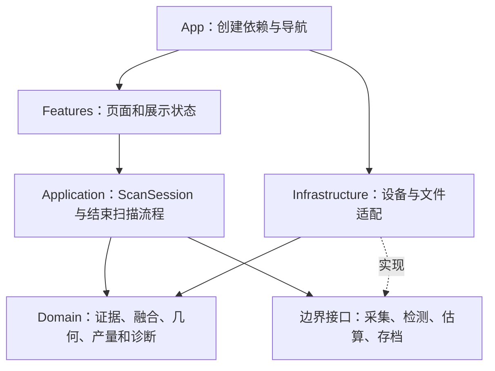
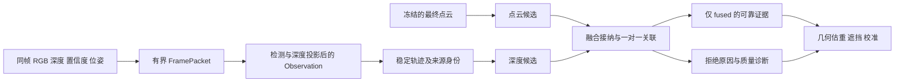

# FruitTreeScanner 整体架构与底层精简设计

日期：2026-09-26。核对基线：`main` / `81f49a6ec3d5`。

状态：设计提案。本文件定义目标、迁移顺序和验收边界；尚未实施下面的生产代码重构。配套实施提示词见 [REFACTOR_PROMPTS_2026-09-26.md](REFACTOR_PROMPTS_2026-09-26.md)。

## 1. 设计结论

建议将现有应用整理为 **Features、Application、Domain、Infrastructure、App** 五个职责区域，继续采用本地 iOS 应用和现有融合流水线。首要改动是集中扫描状态和结束扫描流程，其次收紧证据、缓冲区和存档的所有权。目录迁移放在职责稳定之后。

“精简”的验收对象是重复状态、重复数据转换、跨层副作用和无生产调用的旧实现。文件数量和代码行数只用于观察，不能作为强制删减指标。142 个视图文件本身不构成架构问题；有明确职责的小视图继续保留。

当前基线包含 255 个 App Swift 文件、45,908 行，其中 Core 101 个文件、Views 142 个文件。`ScanCoordinator*` 为 4 文件 / 1,530 行，`Renderer*` 为 10 文件 / 1,841 行，`ImageDetector*` 为 8 文件 / 1,789 行，`PLY*` 为 7 文件 / 1,562 行。这是源码行数统计，包含空行和注释，不代表复杂度分数。

项目当前配置为 iOS 16.0、Swift 5.0，包含 App 和 XCTest 两个 target。迁移初期维持这些条件，不把最低系统版本、语言版本、UI 体系和架构重构混为一次变更。

## 2. 从当前源码得到的重设计依据

下表描述可确认的结构问题及其维护成本，不将结构问题直接当作已复现的运行时故障。行号对应上述基线。

| 优先级 | 当前证据 | 需要改变的边界 |
|---|---|---|
| 首先处理 | [ScanView.swift:20](../../FruitTreeScanner/Views/ScanView.swift#L20) 同时保存录制、估算、结果、保存状态和生命周期副本；[ScanCoordinator.swift:291](../../FruitTreeScanner/Core/ScanCoordinator.swift#L291) 另有处理锁、证据门、tracking 状态 | 一个扫描会话拥有业务状态，UI 接收只读投影；展示开关仍归 UI |
| 首先处理 | [ScanView+Export.swift:54](../../FruitTreeScanner/Views/ScanView+Export.swift#L54) 编排 PLY 导出、估算、结果提交和历史刷新；[同文件:146](../../FruitTreeScanner/Views/ScanView+Export.swift#L146) 直接访问保存服务与文件元数据 | 结束扫描成为一个可取消、可重试的应用流程，视图只发命令 |
| 首先处理 | [FruitDetectionModels.swift:23](../../FruitTreeScanner/Core/FruitDetectionModels.swift#L23) 的 DetectedFruit 携带深度与置信度缓冲区；[ScanFusionYieldBuilder.swift:6](../../FruitTreeScanner/Core/ScanFusionYieldBuilder.swift#L6) 的输入使用 unchecked Sendable | 原始帧由平台适配层持有；算法输入逐步改成拥有明确证据来源的值类型 |
| 随后处理 | [Renderer.swift:37](../../FruitTreeScanner/Core/Renderer.swift#L37) 读取全局设置；[RendererPointCloudExport.swift:223](../../FruitTreeScanner/Core/RendererPointCloudExport.swift#L223) 同时等待 GPU、采样、去噪、缓存和写文件 | 渲染/采集负责硬件缓冲；最终点云快照与文件提交由独立边界负责 |
| 随后处理 | [ScanFusionPipelines.swift:5](../../FruitTreeScanner/Core/ScanFusionPipelines.swift#L5) 输出持有筛色点、聚类点和去噪结果；第 23–24 行又构建位置、颜色数组 | 算法消费明确的点集视图或有界缓冲；阶段输出以结果和统计为主 |
| 随后处理 | [ScanResultExportService.swift:374](../../FruitTreeScanner/Core/ScanResultExportService.swift#L374)、[PLYCompanionResultReader.swift:64](../../FruitTreeScanner/Core/PLYCompanionResultReader.swift#L64)、[BatchExportJSONWriter.swift:78](../../FruitTreeScanner/Core/BatchExportJSONWriter.swift#L78) 分别解释字符串字段 | 一个版本化存档契约；历史、校准、批量导出消费相同的已验证记录 |
| 随后处理 | [ScanHistoryStore.swift:317](../../FruitTreeScanner/Core/ScanHistoryStore.swift#L317) 独立删除文件；[ScanResultExportService.swift:146](../../FruitTreeScanner/Core/ScanResultExportService.swift#L146) 另有带事务保护的丢弃路径 | 同一仓储拥有保存、取消、删除与读取的一致性规则，避免各入口独立决定文件生命周期 |
| 随后处理 | [ScanCoordinator.swift:147](../../FruitTreeScanner/Core/ScanCoordinator.swift#L147) 已有配置快照，但 Renderer、检测加载和导出仍存在独立设置入口；[CalibrationRecord.swift:4](../../FruitTreeScanner/Core/CalibrationRecord.swift#L4) 把模型文件读取、哈希与校准模型放在一起 | 完整 ScanPlan 在开始扫描前生成；模型身份计算归基础设施，校准匹配归领域规则 |
| 最后清理 | Swift 源码搜索中 [YieldEstimator.swift:9](../../FruitTreeScanner/Core/YieldEstimator.swift#L9) 的实例化仅见于测试；[FruitCounter.swift:15](../../FruitTreeScanner/Core/FruitCounter.swift#L15) 则仍被结果合成使用 | 前者列为隔离候选，后者保留有效算法；删除前复核所有 target、脚本和研究依赖 |

两个需要谨慎判断的点：Swift 数组可能共享写时复制存储，不能根据字段数量宣称内存已翻倍；全局点云去噪和筛色后的候选去噪具有不同输入与目的，不能仅因都调用 SOR 就合并。

## 3. 目标职责与依赖



| 区域 | 拥有的职责 | 依赖约束 |
|---|---|---|
| `App/` | 创建一个依赖组合对象、注入文件位置和真实设备实现、组装导航 | 可引用全部区域；全局默认实例只在这里绑定 |
| `Features/` | Scan、History、Results、Calibration、Orchard、Settings 等页面；只读状态与用户动作 | 可调用 Application；不直接执行扫描文件读写或融合算法 |
| `Application/` | 扫描命令、会话状态、任务身份、结束/重试/取消流程、应用级错误 | 使用 Domain 和少量边界接口；不持有 MTKView、ARFrame 或 CVPixelBuffer |
| `Domain/` | 有单位的数据类型、证据接纳、候选关联、几何估重、遮挡/校准规则、结构化诊断 | 可使用 Foundation、simd 及轻量几何值；无 SwiftUI、ARKit、Metal、Vision、CoreVideo 和磁盘访问 |
| `Infrastructure/` | ARKit/Metal 捕获、Vision 推理、帧缓冲、PLY 编解码、事务存档、设置与模型身份加载 | 实现边界接口，向上返回值或受控句柄；不引用页面 |

初期仍为一个 App target，以访问控制和依赖检查约束边界。Domain 真正摆脱平台对象后再评估独立 framework/Swift package；不同时迁移模型资源、Metal shader 和整个构建系统。

只在硬件、文件、异步长任务和测试替身这些真实边界定义接口。数值算法继续使用现有具体类型和纯函数，不给每个 helper 增加 protocol、factory、manager。

建议的主要对象：

- `ScanFeatureModel`：MainActor 上的展示模型，将用户动作转成命令。
- `ScanSession`：扫描业务状态的唯一写入者，接受事件并决定允许的动作。
- `ScanFinalizationWorkflow`：一个会话持有的流程对象，负责排空、冻结、估算、持久化及重试；不另存一套独立生命周期。
- `CaptureAdapter` / `DetectionWorker`：承接当前 Renderer / ImageDetector 的平台边界；保留现有对外 facade 作为短期兼容层。
- `ScanFusionYieldBuilder`：继续作为算法总入口，内部候选、融合、结果合成和诊断职责保持分离。
- `ScanRepository`：统一扫描记录的保存、读取、删除、取消与历史查询。

### 3.1 目标目录与全应用协作

以下是迁移完成后的职责示意；目录调整不需要一次完成，也不要求每个目录建立独立 target。

```text
FruitTreeScanner/
  App/                       启动、依赖装配、导航入口
  Features/
    Scan/                    扫描页面与 ScanFeatureModel
    History/                 历史查询、选择、删除交互
    Results/                 产量、质量和诊断展示
    Calibration/             实测输入与校准交互
    Orchard/                 果园、树与标签交互
    Dashboard/               汇总、趋势与批量导出交互
    Settings/                设置编辑
  Application/
    Scanning/                ScanPlan、ScanSession、ScanFinalizationWorkflow
    Records/                 已验证记录查询、删除和批量导出编排
    Calibration/             校准导入与应用编排
    Ports/                   必需的设备、估算与扫描仓储接口
  Domain/
    Evidence/                观测、候选、可靠证据与来源身份
    Fusion/                  投影数值核心、匹配、融合接纳与去重
    PointCloud/              点集、采样、聚类、几何数值算法
    Yield/                   几何估重、遮挡、校准规则与结果合成
    Diagnostics/             扫描质量、置信度与拒绝原因
  Infrastructure/
    Capture/                 ARKit、Metal、硬件缓冲与同步准入
    Detection/               Vision、CoreML、YOLO 解析与帧调度
    Persistence/             ScanRepository 实现、事务与版本兼容
    Formats/                 PLY、JSON、CSV 编解码
    Configuration/           设置、模型身份和文件位置
  Design/                    现有设计系统与共享视觉组件
```

应用内的数据协作按以下边界收敛：

| 功能 | 输入与动作 | 输出与边界 |
|---|---|---|
| 扫描 | 固定 ScanPlan；开始、暂停、继续、完成、重试、取消 | 会话状态和已提交记录 ID；页面不触碰保存路径 |
| 历史/结果 | 查询摘要；打开某条记录；请求删除 | 摘要用于列表，验证后的 ScanRecord 用于详情和后续处理；损坏状态可见 |
| Dashboard/趋势 | 已提交记录的摘要集合 | 聚合显示模型；聚合放在 Application/Domain，视图只展示 |
| 批量导出 | 用户选择的记录 ID 和导出选项 | Application 获取可验证 revision 并编排，Infrastructure 负责格式与写入 |
| 校准 | 已验证扫描的原始估算基线、实测值与上下文 | Domain 判断匹配/适用规则；基础设施保存，不能对已校准值重复校准 |
| 果园/标签 | 树和标签的编辑结果 | 开始扫描时将需要的身份和值写入 ScanPlan；沿用各自的小型存储 |
| 设置 | 用户编辑的下一次扫描配置 | 扫描启动时解析成计划；进行中的会话不受后续编辑影响 |

不会要求每个页面增加一个同名 service。简单显示继续使用已有组件；只有跨设备、跨文件或跨步骤的业务流程需要 Application 入口。共享结果详情与导出以同一 ScanRecord/诊断模型为输入，避免页面分别推导“可靠”“保存成功”等含义。

## 4. 三个核心数据契约

### 4.1 ScanPlan：扫描开始前固定的配置

包含品类、季节、树 ID、采集配置、检测配置、聚类/融合/估重配置、资源预算、模型身份、算法版本和校准依据。由 App/Application 在开始前创建并验证，随后不可变。

SettingsStore 继续服务设置页面，但已经开始的扫描不再读取它。HUD 的相机分辨率、处理帧数等运行数据转入状态输出。模型指纹在后台准备并缓存；无法确认模型身份时明确停用自动校准。

校准上下文应有明确的 schema 版本和规范化编码。可以引入上下文摘要用于比较，但必须保留可审计参数和旧上下文解码器，不能只把现有长字符串改成新哈希就认定新旧校准兼容。

### 4.2 ScanEvidenceSnapshot：最终估算的不可变输入

包含扫描身份、配置身份、冻结点云、对齐后的观测、候选来源、位姿与坐标定义、有效/拒绝的深度依据和诊断统计。

演进的数据路径：



`Observation` 必须保留 FrameID、检测 ID、品类、检测框、时间戳、相机内参/位姿、可靠投影或明确失败原因、ROI 几何和深度置信度来源。仅存一个中心点不够：后续视锥验证、稳定轨迹、形状判定和诊断仍需要对应证据。

先证明值类型投影与当前缓冲区路径逐阶段等价，再缩短原始深度缓冲生命周期。一个 FramePacket 中的缓冲区可被该帧的多个检测共享；不能为每个检测再复制整幅深度图。原始帧在最后一个消费者结束后释放，长时归档保存紧凑观测。

`ReliableFruitEvidence` 只由融合接纳边界产生，其来源必须为 `.fused`。image-only、cloud-only 和 rejected-depth 进入诊断结构。估重接口接收可靠证据集合，通过 sourceCandidateIDs/TrackID 消费几何，不重新猜测已经明确的关联。

旧 `ValidatedFruit` 和 `ScanFusionYieldBuilder.Input` 在迁移期保留适配入口。最终 Domain 输入使用编译器可检查的 Sendable 值；少量不可避免的 unchecked Sendable 仅留在拥有私有不可变缓冲的平台封装中，并写明线程约束。

### 4.3 ScanRecord：可验证的持久化记录

区分 `DraftScan`、`ScanAssessment`、`CommittedScan`，分别代表未提交采集、估算结果和完整存档。结果生成不等于保存成功。UI 只有在仓储确认完整提交后才显示保存完成。

记录包含 ScanID、revision、源 PLY 身份、配置/模型/算法身份、原始校准基线、估算、诊断及完整性状态。保留现有 JSON/CSV/PLY 字段和读取兼容；新领域类型通过存档 DTO 映射，旧 `YieldResult` 先作为兼容表示。

`ScanFileRecord` 是列表摘要，不能作为文件仍然完整的永久凭证。批量导出和校准导入必须取得仓储验证结果，并在发布前保证所使用的 revision 未改变。

## 5. 状态与并发设计

### 5.1 各种身份有不同用途

| 身份 | 作用 | 失效条件 |
|---|---|---|
| BindingID | 区分 ARSession/MTKView 绑定及延迟回调 | 解绑或换绑 |
| ScanID | 一次逻辑扫描 | 新扫描，或中断后重新开始 |
| EvidenceEpoch | 区分仍允许提交的在途证据 | 系统中断、失败、取消、重置；普通暂停/完成不推进 |
| WorkID | 区分同一扫描中的估算或保存请求 | 同类请求被替代或取消 |

这些身份不能压成一个随任何状态改变而增长的 generation。需要统一定义和验证入口，但必须保留不同失效语义。检测 worker 仍可持有内部队列版本，只有在证明其已被上述身份完整替代后才删除。

### 5.2 单一业务状态与立即关闭采集的边界

ScanSession 建议以 actor 串行处理业务命令和完成事件。UI 的 `isRecording`、`isEstimating`、`canFinish`、`canRetry` 从一个状态快照派生，不再独立写入。

ARKit 回调必须能同步关闭证据准入，因此保留一个职责极小、可同步访问的 `CaptureAdmissionGate`。它只管理绑定/扫描/epoch 和“是否接受新帧”，不拥有产量、导航或保存流程。它是设备边界的同步机制，不是第二套业务状态机。不可把每帧变成一个无界 Task 投递到 actor。

| 事件 | 新帧 | 已接纳的同代证据 | 结果/存档 |
|---|---|---|---|
| 用户暂停 | 关闭 | 允许完成与提交 | 保留，同一扫描可继续 |
| tracking 临时降级 | 关闭 | 保持当前既有策略，通过 token 验证 | 恢复后同一扫描继续 |
| 用户完成 | 关闭 | 排空至已确定的边界 | 冻结一次输入并进入结束流程 |
| 系统中断/失败 | 同步关闭并失效 | 丢弃旧 epoch 结果 | 显式恢复或重开，沿用当前产品规则 |
| 取消/新扫描 | 关闭并失效 | 旧任务不得污染新状态 | 取消未提交工作；已提交记录按仓储规则保留 |

每次 await 之后都可能发生取消或替代，提交前必须复核对应 WorkID 和 ScanID。actor 自身不保证跨 await 的事务原子性。GPU 命令缓冲和 Vision 请求继续由各自适配器串行/限量管理，不把阻塞计算塞到 MainActor 或会话 actor 中。

### 5.3 明确的结束扫描流程

`close admission → drain accepted image work and GPU writes → freeze evidence → write source PLY → estimate → commit companions → completed`

当前 GPU 写入等待、检测排空和保存重试已有实现，迁移时复用并统一错误模型。排空改为可取消的完成通知或已接纳任务计数屏障，逐步替换 25 ms 轮询；不能把超时当作成功排空，也不能静默丢最后一帧。

失败状态携带阶段和续作数据：PLY 失败保留冻结快照，估算失败保留输入，结果提交失败保留同一扫描的结果与源文件。重试只执行失败阶段及必要后续步骤。不要重新拍摄、重新生成 ScanID 或重复消耗证据。

取消与提交发生竞争时，由仓储决定唯一的提交/丢弃顺序。取消返回前应能解释是否已经完整提交；完整记录不会因迟到的 UI 清理任务被误删。

## 6. 底层精简设计

| 底层部分 | 保留的能力 | 精简方法及限制 |
|---|---|---|
| ARKit/Metal | 深度与 tracking 门控、GPU 在途屏障、环形点缓冲、测距和预览 | CaptureAdapter 拥有捕获缓冲；Renderer 渐进收敛到绘制/交互。先移出文件写入和全局设置读取，再考虑拆硬件对象 |
| 点云快照 | 预览与最终估算的不同采样预算、最终 PLY 与估算证据一致 | 一个不可变 FinalPointCloud 供保存/估算消费；记录采样和去噪身份。预览快照单独限量，不能冒充最终证据 |
| 点表示 | 位置、颜色、置信度、必要来源 | 定义一个领域 PointSample；GPU ParticleUniforms 和 SceneKit 顶点表示留在适配层。避免对整个输入反复执行位置/颜色 map；先提供只读访问方式并测量 |
| 中间结果 | 聚类/去噪计数、候选、质量数据 | 阶段输出保留算法后续真正使用的数据；大数组在最后消费者后释放。COW 实际拷贝与峰值存活必须测量 |
| PLY | 有界头验证、ASCII/二进制兼容、取消与错误回收 | 解析器继续流式；写入器逐步由整份 Data 改为分块写临时文件、成功后发布。保持列、单位、精度和区域设置约定 |
| 深度采样与投影 | 原始图像坐标、相机负 Z 前方、同帧内参/位姿、置信度拒绝 | 共用一个数值投影核心；CoreVideo 只负责提供受控深度访问。保留 ROI 网格、连通性和形状判定的原语义 |
| 检测调度 | 输入节流、单待处理帧、串行推理、代次失效 | 用单 worker 明确接纳/完成/取消，集中释放缓冲；模型加载、YOLO 张量解释仍保持现有可测试实现 |
| 融合与估产 | 稀疏一对一分配、3D 去重、sourceCandidateIDs、实测几何、质量降级 | 领域结果显式携带质量/拒绝原因；类型限定可靠产量输入。结构迁移期间不改阈值和公式 |
| 配置 | 品类参数、实验阈值和校准隔离 | 用 ScanPlan 汇总而非再造一套默认值；硬件预算与算法阈值分开命名，二者均可审计 |
| 小型持久化 | 设置、果实参数、标签与校准的各自语义 | 只复用已有有界读取、原子写、版本保存原语；不把它们统统塞进扫描事务仓储 |

初始预算继承当前值：捕获默认 1,000,000 点、设置上限 3,000,000 点；预览采样上限 240,000，最终分析输入上限 120,000；活动检测窗口默认 360 帧，归档轨迹保留稳定性所需观测。帧数上限不能代替字节预算，后续需记录 RGB/深度/置信度缓冲实际占用。

### 存档的统一入口

`ScanRepository` 封装现有事务服务、companion 校验和扫描文件生命周期。先统一调用入口，继续使用当前经过测试的事务互斥与失败恢复实现。将实现改成 actor 并不是删除事务保护的依据；阻塞文件操作交给受控 I/O worker。

内部使用 `ScanMetadataDTO`、`CompletionManifestDTO`、结构化 `DiagnosticsDTO`。旧字段兼容和 `[String: Any]` 解读集中在 legacy codec，领域和页面不再直接取字符串键。

必须保持：manifest 最后发布、源 PLY SHA256、sidecar SHA256、revision 一致、大小限制、损坏/不完整状态和失败恢复标记。第一轮 DTO 改造复用现有编码适配器；更换 JSON 数字格式或规范化规则会影响摘要/revision，需单独版本化。校验摘要时使用原始文件字节，不能解码再编码后比较。

历史列表可以缓存摘要，但缓存不赋予永久完整性。没有不可变 revision/读取快照保障时，继续保留批量导出前后源校验。单凭路径、mtime 或大小相等不足以代替内容一致性。

## 7. 保留、合并、隔离、删除清单

| 动作 | 对象 | 判断依据 |
|---|---|---|
| 保留算法职责 | PointCloudCandidatePipeline、DetectionDepthCandidatePipeline、FusionEvidencePipeline、YieldResultComposer、ScanFusionDiagnosticsUpdater | 当前流水线边界有业务意义；可改变输入/输出类型，不合成一个巨型 estimator |
| 保留可测试实现 | KDTree、DBSCAN、去噪、YOLO parser、稀疏匹配、几何、遮挡 | 改调用边界时先保持数值行为 |
| 汇总到一个入口 | 结束扫描、重试保存、丢弃未完成产物 | 当前分布在 View、Coordinator、Controller、Service |
| 集中契约 | metadata/manifest 的字段映射、扫描设置快照、错误与诊断编码 | 消除多处解释同一数据 |
| 隔离候选 | YieldEstimator 旧双路线实现及仅服务它的入口 | 本轮 Swift 搜索未发现 App 调用；仍需检查研究/脚本/target，再决定移入测试/研究支持还是删除 |
| 保留后简化形式 | FruitCounter | 当前生产调用存在；可转为无状态具体函数，不能当作死代码删除 |
| 完成迁移后删除 | 已无调用的 facade、重复缓存、旧状态字段、只转发且无兼容职责的 wrapper | 必须具有迁移后的调用搜索、构建和行为测试证据 |
| 保留资产 | 诊断、历史记录、实验阈值、模型、训练/论文关联材料 | 不通过删能力、删异常分支或删回归测试获得更少行数 |

## 8. 分阶段迁移

| 阶段 | 可独立交付的范围 | 关键验收 / 回滚位置 |
|---|---|---|
| R0 基线 | 当前调用链、状态/数据契约、回归样例与测量入口 | 记录当前 HEAD；已有测试作为基线，不新增空壳体系 |
| R1 配置与依赖 | AppDependencies + 不可变 ScanPlan，后台准备模型/校准身份 | 扫描途中改设置不改变本次计划；旧配置入口暂作适配 |
| R2 结束扫描流程 | ScanFinalizationWorkflow，视图改为命令与状态展示 | PLY/估算/结果保存各阶段失败能准确重试；旧协调器继续驱动设备 |
| R3 会话所有权 | 单一业务状态、统一身份契约、同步 admission gate | 暂停保留在途证据，中断/取消拒绝旧结果；保留 R2 流程接口回滚 |
| R4 证据与领域 | 帧封装、Observation、可靠证据类型、结构化诊断 | 同帧一致、置信度拒绝、候选身份/几何不丢失；逐阶段双实现比较 |
| R5 点云底层 | 最终快照所有权、必要点表示、有界阶段输出、流式 PLY 写入 | 保存与估算消费同一最终输入；上限、文件等价、峰值内存和取消回收 |
| R6 存档契约 | ScanRepository + DTO/legacy codec；历史、批量、校准和删除接入 | 旧存档可读；失败事务不变完整；并发删/存和源变化有确定结果 |
| R7 清理与边界 | 删除已失去职责的旧入口，整理目录，评估 Domain 独立 target | 无双套生产入口；App 行为不变；完整模拟器、Release 和真机计划 |

按顺序开展，R5/R6 在接口稳定后可以独立安排。一个阶段允许拆成多个小提交；不把全部文件移动和行为改变放到同一提交。每次只让一套实现拥有生产副作用，旧实现仅作为暂时 facade 或离线差分参考。

## 9. 验证和完成标准

先执行变化相关的测试，再在状态、证据、存档阶段结束时执行完整 iOS 模拟器测试与 Release 构建。记录命令、退出码、实际测试数量和失败详情。先前合并轮次的 890 项通过记录只说明当前基线；不能冒充未来重构的测试结果。

必测场景：暂停/继续时的在途检测，tracking 降级与恢复，旧 ARSession 回调，中断/取消/新扫描，GPU 写入未完成时结束，排空期间取消，结果保存重试，取消与提交竞争，源 PLY 被替换，manifest 缺失/损坏，写入失败与恢复，批量数量溢出，旧校准上下文，低置信度深度，拒绝候选回退，候选顺序变换和实测几何保留。

| 指标 | 达标定义 |
|---|---|
| 业务状态 | 生命周期只有一个权威写入者；UI 中的业务布尔值均有明确派生规则 |
| 领域边界 | Domain 无平台缓冲、磁盘访问和全局设置读取；可靠产量接口只接收融合接纳产物 |
| 生产入口 | 一个结束扫描流程、一个扫描存档入口；临时兼容层有退出条件 |
| 诊断 | 既有 zeroYieldReasons、扫描/置信度诊断和已导出字段保持可解释、可追溯 |
| 数据兼容 | 现有 PLY、CSV、metadata、manifest 1–3 和旧校准记录通过兼容样例 |
| 资源 | 继承采样/聚类/缓冲上限；同设备同输入测量峰值内存和阶段耗时，不超过确认的回归预算 |
| 真机 | 用同一 LiDAR 设备、扫描路线和参数比较 30/60/120 秒场景，记录帧率、主线程耗时、内存、温度与估产误差 |

本次只做源码与设计检查，没有新建可执行架构、没有运行新的 App 测试，也没有取得真机性能或精度数据。不得预先承诺某个降耗百分比。

方案文档判断：**mergeable**。目标架构的实现、兼容迁移和真机验收尚待按阶段完成。
