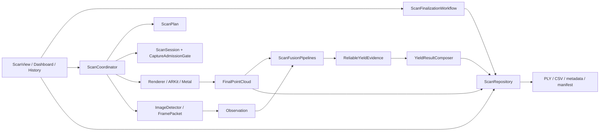

# FruitTreeScanner 架构迁移实施与验收记录

日期：2026-09-27。对应 `REDESIGN_BLUEPRINT_2026-09-26.md` 的 R0–R7。本文保留该日实施与验收快照；后续改动及截至 2026-10-01 的验证见 [重构迭代执行记录](REFACTOR_ITERATIONS_2026-09-27.md)。原蓝图和提示词是设计材料，不是已通过验收的声明。

## 当前生产路径



| 操作 | 生产入口 | 持有的边界 |
|---|---|---|
| 开始、暂停、继续、中断和取消 | `ScanCoordinator` → `ScanSession` | ScanID、绑定 ID、证据 epoch、同步帧准入 |
| 检测 | `ImageDetector` → `FramePacket` → `Observation` | 同帧颜色、深度、置信度、姿态与有界采样；队列代次 |
| 完成与重试 | `ScanFinalizationWorkflow` | 单次 WorkID、点云导出、估算、伴随文件提交、取消丢弃 |
| 可靠估产 | `ScanFusionPipelines` → `ReliableYieldEvidence` → `YieldResultComposer` | 只有 `.fused` 进入可靠计数和重量；零产和拒绝诊断保留 |
| 点云冻结 | `Renderer.makeFinalPointCloudSnapshot()` | 同一有界点集供 PLY 写入和估算，缓冲区修订号参与身份 |
| 扫描文件读写删 | `ScanRepository` | 按源 PLY 路径互斥、草稿、提交确认、摘要、校准来源、导入、删除 |
| 批量导出 | `BatchExportService` → `ScanRepository.validateBatchRecord` | 写入前后分别验证源与伴随文件，临时文件另行管理 |

`ScanResultExportService`、`PLYCompanionResultReader`、`PLYImportService` 和 PLY 写入器保留为仓储下的格式/事务实现。测试可直接调用这些实现做故障注入；页面和完成流程使用仓储入口。

## 存档兼容和事务

- PLY 的列、单位、精度和现有 ASCII/二进制读取路径保留；写入改为有界分块临时文件，成功后独占发布。解析仍做有界头验证和流式 ASCII 读取。
- metadata 仍用原 JSON 编码器和 `.prettyPrinted`、`.sortedKeys` 选项；`ScanMetadataDTO` 和 `DiagnosticsDTO` 为读取侧提供有类型的关键字段。`CompletionManifestDTO` 以原字段编码。摘要对原始文件字节计算，不对解码后重新编码的数据计算。
- manifest schema 1–3 的读取保留。schema 2/3 的 sidecar SHA-256 和 schema 3 的源 PLY SHA-256 保留。基线代码先发布 manifest；现在 metadata/CSV 发布后才发布 manifest。写入前再次核对源 PLY 摘要，提交返回前将本次修订号、metadata SHA-256 和源 PLY SHA-256 与完整记录逐项核对；若另一提交抢先替换，则拒绝宣告本次保存成功。
- 损坏、缺失或 revision 不一致时，记录保持 invalid/incomplete；历史摘要不作为永久完整性凭证。删除先清理伴随文件，成功后才移除 PLY 锚点；失败时返回残留文件并保持可重试。
- 校准导入只接受有完整源身份和上下文的 schema 3 扫描；旧 `calibration_records.json` 继续按原 Codable 和 `.atomic` 方式读取/保存，未知上下文不会自动升级。设置和标签仍沿用各自原子持久化。
- 仓储互斥覆盖扫描结果提交、点云发布、历史摘要读取/删除、批量源验证和校准来源读取。导入候选名在独占提交时协调；命名冲突继续生成独立文件。

## 旧路径处置

| 路径 | 处理和依据 |
|---|---|
| `YieldEstimator` 双路线 | 全仓 Swift 调用搜索只有 `YieldEstimatorTests` 使用；迁到 `FruitTreeScannerTests/LegacyYieldEstimator.swift`，移出 App target，保留研究回归测试。旧研究文档引用是历史说明，未删除。 |
| `ScanCoordinator.extractColoredPoints()`、`Renderer.makeAnalysisPoints()` | 调用搜索确认只彼此转发，生产已使用 `FinalPointCloud`；删除。 |
| `PointCloudCluster.processInMemory(position:colors:)` | 生产与测试均无调用，且会额外构造整份点数组；删除。同步 `processSync(points:)` 仍服务算法回归测试。 |
| `FruitCounter` | 仍由 `YieldResultComposer` 调用，保留算法与兼容测试。 |
| `FruitInfo`、`ScanYieldDiagnostics.shortStatus` | 第 26 轮全仓搜索确认前者只服务旧研究估算器、后者无消费者；前者按原文移入测试支持，后者删除。结果和诊断字段不变。 |

新文件逐步归入 `Application/`、`Domain/`、`Infrastructure/Persistence/`；Renderer、检测门面和旧格式服务继续按消费者渐进迁移。后续已分离计划值与设置捕获、品类规则与展示、缓冲输入与数值融合。第 26 轮已收敛结果/质量/诊断值，整个 Domain 的 24 个源文件独立编译通过。生产继续保持单 App target，独立编译门禁不是新增生产框架的声明；避免同时变更模型、shader 和构建体系。第 27 轮已将完整 Domain 门禁接入现有 CI，并完成本地构建及失败传播验证；远程工作流尚未运行。实际 UI 走查及物理性能/精度仍有验收范围，具体证据及未完成项见迭代记录。

## 验证记录

| 阶段 | 当前证据 |
|---|---|
| R0 | `REFACTOR_BASELINE.md` 记录 HEAD、两组 467 项基线测试和缺口。 |
| R1–R3 | 配置/生命周期定向测试后，完整 iOS 27 模拟器测试 900 项通过；Release 模拟器构建成功。 |
| R4 | 融合、去重、估产、诊断等定向测试 235 项通过。 |
| R5 | 点云、导出和批量等定向测试 293 项通过；含新旧 PLY 字节等价、取消清理、同名冲突和快照修订号测试。 |
| R6 | 2026-09-27 定向 328 项通过；完整 iOS 27 模拟器测试 912 项通过，0 失败，结果包 `/tmp/fts-r6-full-20260927.xcresult`；Release 模拟器构建退出码 0。 |
| R7 | 旧路线隔离后的 `YieldEstimatorTests` + `PointCloudClusterTests` 52 项通过；仓储摘要及旧估算定向组 268 项通过；修复保存确认竞态后 `BatchExportServiceTests` 107 项通过。最后一次代码清理后，完整 iOS 27 模拟器测试 914 项通过，0 失败、0 跳过，结果包 `/tmp/fts-r7-final-clean-20260927.xcresult`；Release 模拟器构建退出码 0；`git diff --check` 退出码 0。 |

测试样例覆盖伴随文件损坏/缺失、旧 schema、源变化、保存/删除竞争、取消/失败恢复、批量总数溢出和校准旧记录。新增仓储故障注入全部使用临时目录。真正的断电中断、磁盘耗尽和 LiDAR 扫描无法由模拟器测试证明。

模拟器人工走查：主工作台正常启动；新建扫描进入五步设置后可取消返回；历史页面能显示已有两条未完整记录及恢复提示；批量导出显示 0/0 条可导出、2 条排除记录，导出按钮禁用；算法校准页面正常打开并显示参数与无校准数据状态。未删除已有记录，也未创建测试扫描。模拟器无 LiDAR 输入，因此完成/重试、真实融合结果、真机校准来源和有完整记录的批量输出未作 UI 实测。

最终验证命令在工程根目录执行，Xcode 均使用命令级 `DEVELOPER_DIR=/Users/reece24/Downloads/Xcode-beta.app/Contents/Developer`：

```sh
xcodebuild test -quiet -project FruitTreeScanner.xcodeproj -scheme FruitTreeScanner \
  -destination 'platform=iOS Simulator,id=C722B4F0-E16F-4C14-84A1-8C796DB0FE11' \
  -resultBundlePath /tmp/fts-r7-final-clean-20260927.xcresult
xcrun xcresulttool get test-results summary \
  --path /tmp/fts-r7-final-clean-20260927.xcresult
xcodebuild build -quiet -project FruitTreeScanner.xcodeproj -scheme FruitTreeScanner \
  -configuration Release -destination 'generic/platform=iOS Simulator' \
  CODE_SIGNING_ALLOWED=NO
git diff --check
```

上述 2026-09-27 快照时，所有实现留在本地 `codex/scan-architecture-refactor` 分支的工作区，尚未提交或推送。初始存在的 `docs/README.md` 改动和两份用户架构文档当时保持原样。新增实现与验证文档按阶段标注。DeviceHub 当时检测到一台已配对的 iPhone 17 Pro（iOS 27.2），但没有可重复的果树、扫描路线和人工实测基准；未在该设备执行 LiDAR 采集，也未取得真机精度或物理内存峰值证据。

2026-10-01 用户要求提交此前改动后，架构与回归测试已形成本地提交 `be3de463`，Domain/CI 工具已形成 `ec782e82`；设计与验收记录另行提交。提交前复跑完整模拟器测试 1001 项通过、0 失败/跳过，整个 Domain 的 24 个源文件独立编译成功。没有推送或合并；完整界面流程、远程 CI 和物理设备验收仍待完成。具体提交检查点见迭代记录。

## 仍需验收

1. 在 LiDAR 设备上分别完成 30、60、120 秒采集，记录帧吞吐、最终点数、GPU 排空、写入/估算时间、内存峰值和温度；对同一棵树比较候选身份、融合数、实测几何、零产原因和产量。
2. 用 Xcode Instruments 对 RGB/深度/置信度缓冲、Metal 点云和 PLY 写入测量实际同时存活与物理内存峰值。代码日志中的 payload 字节估计不是物理峰值测量。
3. 继续手动走查完成/重试、历史删除、有完整记录的批量导出和校准导入；本轮只验证了上述模拟器导航与不完整记录排除。LiDAR 质量与真实准确性必须在支持设备上验证。
4. 使用可恢复的外部故障环境检查断电/磁盘满；现有临时目录故障注入只证明进程内失败回滚。
