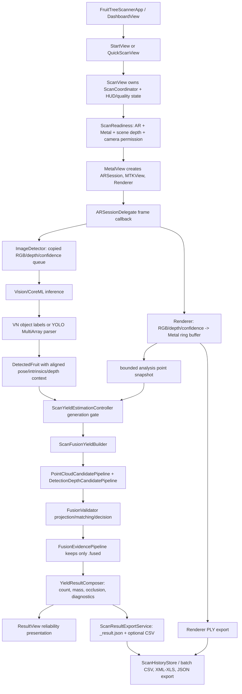

# FruitTreeScanner Full App Audit

Audit date: 2026-07-11

Audited revision: `f2d1aa8e1e03bd5f10fe46d7baf668d6569fe0d1` (`origin/main`)

Audit mode: read-only source/configuration review, build/test verification, and risk ranking. No production code, model, dataset, label, approval CSV, or build setting was changed.

## 1. Executive Summary

FruitTreeScanner builds successfully and its unusually broad pure-logic XCTest suite passes: 441 tests across 24 suites. The current production yield call path is service-split, `ScanYieldEstimationController` is genuinely wired into `ScanCoordinator`, and `FusionEvidencePipeline` filters the final reliable evidence to `.fused` before `YieldResultComposer` computes count and weight. Image-only and cloud-only evidence do not enter reliable yield in the inspected production path. Yield-request and the two principal UserDefaults stores have generation gates, the PLY ASCII display parser is streaming, and recognition diagnostics reach both single-scan and batch JSON.

The repository is not release-ready. Two P0 fail-open paths remain:

1. A YOLO MultiArray model whose runtime labels are absent is interpreted with the legacy 26-class fixed order. A future six-class model without readable metadata can silently map class indices to the wrong fruits instead of failing closed.
2. If copying a depth-confidence map fails while RGB and depth copies succeed, the frame continues without confidence. `hasAlignedDepthContext` still accepts it and `DepthSampler` then accepts all valid numeric depth, so originally low-confidence depth can become `.fused` evidence.

There are six P1 findings: unsynchronised scan/AR callback state; unordered calibration saves; orphan PLY files shown as legitimate zero-apple results; missing privacy manifest despite required-reason API use; unhandled AR session/background interruption; and unresolved AGPL/commercial licensing for the bundled production model. These findings block a release-readiness decision even though simulator tests pass.

Decision: **needs changes**. No merge of a release candidate should occur until P0 items are fixed and device-tested, P1 persistence/lifecycle items are resolved, and privacy/licensing gates are cleared.

## 2. Audit Scope and Coverage

Coverage method combined complete tracked-file inventories, compiler target membership, full builds/tests, repository-wide risk-pattern searches, structured validation of JSON/plist/localization resources, declaration/call-site indexing, and line-by-line review of the production pipeline, stores, exporters, parsers, tests, and ML control scripts.

| Artifact | Total | Inspected | Notes |
| --- | ---: | ---: | --- |
| Swift files | 273 | 273 | 253 App source, 19 XCTest files, 1 Swift ML audit tool. All App files were compiler-validated; high-risk paths were manually reviewed. |
| Metal files | 1 | 1 | `Shaders.metal`, including unprojection, confidence filtering, ring-buffer indexing, and compute kernels. |
| Python ML/tools | 28 | 28 | Static review plus unittest/py_compile and focused mapping/model checks. |
| Test files | 19 Swift + 2 Python | 21 | 441 XCTest cases and 11 Python tests executed. |
| Configuration/resource metadata | 38 | 38 | Project, plist, storyboard, strings, workflow, YAML/JSON/model manifests; all tracked JSON/plist files parsed successfully. |
| Documentation | 48 | 48 indexed; relevant architecture/dataset/validation docs manually reviewed | Older reports were treated as leads, not current truth. |

Generated/binary content intentionally skipped from byte-level semantic review:

- 4,664 tracked raster images (4,600 are source-dataset images; App artwork was checked through asset metadata/build validation).
- 4,600 YOLO label files were not individually read; dataset audit reports and dataset tooling validated structure/distribution.
- 12 model/weight binaries (`.mlmodel`, `.bin`, `.pt`) were not reverse-engineered. Their manifests, target membership, `coremlc` metadata, label order, and interfaces were inspected.
- Xcode generated intermediates, simulator state, training plot images, and DerivedData were excluded.

The applied six-class image/label copy exists in the user's original working tree but is not tracked on `main`; a clean checkout contains only `DATASET_VERSION.md` and the post-apply report. This audit did not alter or copy that local dataset.

## 3. Build and Test Results

### Environment discovery

```sh
DEVELOPER_DIR=/Users/reece24/Downloads/Xcode-beta.app/Contents/Developer \
xcodebuild -list -project FruitTreeScanner.xcodeproj

DEVELOPER_DIR=/Users/reece24/Downloads/Xcode-beta.app/Contents/Developer \
xcrun simctl list devices available
```

- Project: `FruitTreeScanner.xcodeproj`; no separate workspace is required.
- Scheme: `FruitTreeScanner`.
- Available destination: `FruitTreeScanner-iPhone-17-iOS27`, ID `C722B4F0-E16F-4C14-84A1-8C796DB0FE11`.

### Debug build

```sh
DEVELOPER_DIR=/Users/reece24/Downloads/Xcode-beta.app/Contents/Developer \
xcodebuild build \
  -project FruitTreeScanner.xcodeproj \
  -scheme FruitTreeScanner \
  -configuration Debug \
  -destination 'platform=iOS Simulator,id=C722B4F0-E16F-4C14-84A1-8C796DB0FE11' \
  -derivedDataPath /tmp/fts-sol-audit-derived \
  CODE_SIGNING_ALLOWED=NO
```

Status: passed. App build warnings: 0. The compiler file list contains all 253 tracked App Swift sources plus one generated CoreML interface.

### Full iOS tests

```sh
DEVELOPER_DIR=/Users/reece24/Downloads/Xcode-beta.app/Contents/Developer \
xcodebuild test \
  -project FruitTreeScanner.xcodeproj \
  -scheme FruitTreeScanner \
  -destination 'platform=iOS Simulator,id=C722B4F0-E16F-4C14-84A1-8C796DB0FE11' \
  -derivedDataPath /tmp/fts-sol-audit-derived \
  CODE_SIGNING_ALLOWED=NO
```

Status: passed, 441/441 cases, 24 suites, 0 failures. Two environment/toolchain linker warnings occurred because the test target deploys to iOS Simulator 16.0 while the Xcode 27 beta XCTest binaries were built for 17.0. They did not affect execution.

### Python tests and compile

```sh
python3 -m unittest discover -s tools/ml -p 'test_*.py' -v
python3 -m py_compile $(git ls-files '*.py')
```

- ML tests: passed, 11/11.
- `py_compile`: failed. First and only blocking syntax error: `tools/ml/train_yolov8.py:19`, where Colab notebook syntax `!pip install ...` appears in a `.py` file.

Focused read-only checks:

```sh
python3 tools/ml/check_data_yaml_app_mapping.py
python3 tools/ml/export_coreml.py --dry-run
python3 tools/ml/check_model_metadata.py FruitTreeScanner/Core/FruitsDetector.mlpackage --json
DEVELOPER_DIR=/Users/reece24/Downloads/Xcode-beta.app/Contents/Developer \
xcrun coremlc metadata FruitTreeScanner/Core/FruitsDetector.mlpackage
```

All focused checks returned success. The production model is an ML Program, input RGB 320×320, output Float32 `[1, 30, 2100]`, and exposes the expected 26 labels through creator-defined metadata. `check_model_metadata.py` emitted local `coremltools` proxy warnings but successfully parsed the protobuf and reported `labels_match_expected: true`.

No physical-device validation was performed. LiDAR accuracy, confidence-map behavior, tracking interruption, memory/thermal growth, and camera-orientation correctness remain device-only gates.

## 4. Production Architecture and Data Flow



| Stage | Owner and boundary | Input → output | Cancellation/stale handling | Failure/user result |
| --- | --- | --- | --- | --- |
| Launch/navigation | SwiftUI main actor, `NavigationRouter` | URL/AppIntent → destination | Pending URL request consumed once | Invalid routes ignored. |
| Readiness | `ScanReadiness.determine`, async then MainActor | device/permission → readiness enum | view-active check rejects late readiness | Blocking overlay and Settings/Back actions. |
| Session | `ScanCoordinator.bind` + `ARSession` | configured tracking → frames | teardown pauses session and clears delegates | Runtime depth state shown in HUD. |
| Point capture | `Renderer`, MTK/Metal callbacks | synchronized AR frame textures → bounded ring buffer | recording gate; export drains in-flight buffers | No point cloud blocks finish/export. |
| Detection | ARSession delegate + `ImageDetector` serial queue | copied pixel buffers → `[DetectedFruit]` | queue generation, one preparing/pending frame, task cancellation | model failure returns no boxes and records diagnostics. |
| Fusion | detached yield task | points + saved aligned detections → validated fruits | request generation rejects stale delivery | no fused fruit produces zero yield with reasons. |
| Persistence | serial export queue | `YieldResult` → JSON/CSV | no scan transaction ID beyond filename | error toast; PLY may already exist (P1-03). |
| History/export | detached reads/writes | PLY + companions → records/batch files | load generation; batch cancellation | missing companions silently default today (P1-03). |

Lifecycle reconstruction:

- Start: `startRecording` cancels prior detection/yield work, clears queue, counters, detections, archived fusion evidence, HUD, camera motion, and resets Renderer capture.
- Pause: `stopRecording` triggers a final queue process and sets Renderer recording false; point cloud remains.
- Resume: cancels any yield request, retains queue/detections/point cloud, and resumes scan progress.
- Finish: stops recording, writes PLY, flushes detection, snapshots points/evidence, estimates, writes JSON/CSV, and displays result.
- Cancel/dismiss: stops if needed, clears measurement, tears down coordinator, cancels detection/yield work, and dismisses.
- New scan: a new `ScanView` coordinator plus explicit `startRecording` reset protects most scan-local data.
- Background/foreground: only active-phase readiness refresh exists; inactive/background and AR interruption are not handled (P1-05).
- App termination: no explicit flush/transaction recovery. UserDefaults saves and a scan between PLY and sidecar completion can remain incomplete.

Reliable-yield entry: only `FusionEvidencePipeline.validatedFruits`, filtered to `.fused`, enters count and mass. `imageOnly`, `trackedImage`, cloud candidates, and cloud-only conservative state are diagnostics only in this production route.

## 5. Verified Safety Invariants

| Invariant | Status | Production evidence | Test evidence |
| --- | --- | --- | --- |
| `.fused` is the only reliable yield source | verified | `ScanFusionPipelines.swift:163-186`; composer consumes only that array | `ScanFusionYieldBuilderTests` conservative/image/tracked tests |
| imageOnly/cloudOnly excluded from reliable count/weight | verified | `FusionEvidencePipeline.run`; no cloud-only fruit is constructed in conservative output | cloud-only, tracked-image, rejected ROI tests |
| Explicit low confidence map cannot fuse | verified | `DepthConfidenceSampler` rejects below configured level | low-confidence projection and occlusion tests |
| Missing/dropped confidence cannot fuse | **not verified / regressed** | confidence copy failure becomes nil; nil bypasses filtering | no failure-copy test (P0-02) |
| Rejected depth candidate cannot upgrade by fallback | verified | `rejectedByDepthCandidate → .rejected` | dedicated builder test |
| zero-yield and recognition diagnostics preserved | verified | diagnostics updater → result → single/batch JSON | diagnostics/export tests |
| stale yield request cannot submit | verified | `YieldEstimationRequestGate` on begin/cancel/deliver | request-gate tests |
| principal UserDefaults saves reject stale generations | verified | `FruitParametersStore`, `TagStore` | rapid-save race tests |
| all persistence paths generation-gated | not verified | calibration file saves have no gate | round-trip only (P1-02) |

## 6. P0 Findings

### FTS-P0-01 — Label-less MultiArray models fall back to unsafe 26-class indices

- **Severity:** P0
- **Confidence:** high
- **Category:** Vision/CoreML, wrong reliable yield
- **Affected file:** `FruitTreeScanner/Core/ImageDetectorYOLOParser.swift`
- **Affected symbol / approximate lines:** `parseYOLOMultiArray`, 119-125; `ImageDetectorModelLoading.swift` 140-179; `FruitDetectionModels.swift` 124-135
- **Production path reachable:** yes
- **Trigger condition:** A YOLO MultiArray model loads successfully but neither `modelDescription.classLabels` nor parseable creator-defined `names` metadata is available. This is especially dangerous for a future six-class model.
- **Observed or inferred behavior:** Confirmed by code and the test named `testParseYOLOMultiArrayUsesLegacyFixedOrderOnlyWhenRuntimeLabelsUnavailable`: the parser calls `FruitCategory.fromCustomModel(classIndex)`. For six-class order `[apple, orange, pear, persimmon, grape, strawberry]`, class 2 is silently interpreted as mandarin, class 3 as pomelo, class 4 as pear, and class 5 as peach.
- **User impact:** Fruit can disappear under selected-type filtering or, for another selected fruit, be counted and weighed as the wrong species while presented as fused/reliable.
- **Technical impact:** Violates fail-closed model replacement and makes six-class safety dependent on metadata that is not enforced at load time.
- **Evidence:** `ModelLabelCompatibilityDiagnostics.unavailable.usesRuntimeLabelMapping == false`; parser fallback is unconditional for unavailable metadata. Current 26-class production metadata is valid, so the current artifact is not misread.
- **Why tests do/do not catch it:** Tests catch and currently endorse the fallback; they do not assert that non-26 output without metadata must be rejected.
- **Recommended fix:** Validate output class count against runtime labels at model load/inference. Require runtime labels for any non-exact legacy artifact; on missing/count mismatch, return no detections with an explicit diagnostic. Prefer fail closed for all MultiArray models without authenticated label metadata.
- **Recommended tests:** 6-class/no-metadata rejection; 26-class/no-metadata policy test; metadata count ≠ channel count; reordered six-class success; unknown label rejection; production model integration load.
- **Regression risk:** medium
- **Needs physical-device validation:** no for mapping; yes for final replacement-model acceptance.

### FTS-P0-02 — Confidence-map copy failure converts unknown/low-confidence depth into eligible fused evidence

- **Severity:** P0
- **Confidence:** high for the code path; medium for field frequency
- **Category:** LiDAR/depth/fusion correctness
- **Affected files:** `ImageDetectorQueue.swift`, `FruitDetectionModels.swift`, `FusionValidatorProjection.swift`
- **Affected symbols / approximate lines:** `makeQueuedFrame` 34-50; `enqueueFrame` 133-140; `DetectedFruit.hasAlignedDepthContext` 27-29; `DepthSampler.init/depth` 702-744
- **Production path reachable:** yes
- **Trigger condition:** RGB and depth deep copies succeed but the confidence-map copy fails (allocation pressure, unsupported buffer copy, or transient CoreVideo failure).
- **Observed or inferred behavior:** Confirmed code flow: the frame is retained with `depthConfidenceMap == nil`, only a warning is logged, `hasAlignedDepthContext` returns true because it checks only depth/pose/intrinsics/image size, and `DepthSampler` installs no confidence sampler and accepts any finite depth in range. An originally low-confidence surface can build an ROI candidate and be matched as `.fused`.
- **User impact:** An unreliable depth return may contribute to a reliable count and weight without any visible blocking state.
- **Technical impact:** Bypasses a thesis-critical invariant through fallback state loss.
- **Evidence:** The explicit low-confidence-map path is safe, but the nil-map path is treated as reliable; tests also construct “reliable” detections with a depth map and no confidence map.
- **Why tests do/do not catch it:** Tests cover confidence value 0 when the map exists. They do not simulate confidence-copy failure with a valid depth copy or require confidence provenance for fusion.
- **Recommended fix:** Carry a depth-confidence provenance enum. Fail closed for fusion when confidence was expected but could not be copied; allow any intentional no-map compatibility mode only as diagnostics and never `.fused` without a separately justified policy.
- **Recommended tests:** Partial buffer-copy failure; missing confidence map in live scan; low map dropped after copy failure; zero-yield reason/export diagnostic; memory-pressure integration test.
- **Regression risk:** high because it changes fusion eligibility
- **Needs physical-device validation:** yes

## 7. P1 Findings

### FTS-P1-01 — Scan state crosses ARSession, Metal, task, and MainActor boundaries without one isolation model

- **Severity:** P1
- **Confidence:** medium
- **Category:** concurrency/lifecycle
- **Affected files:** `ScanCoordinator.swift`, `ScanCoordinatorARSession.swift`, `ScanCoordinatorWorkflows.swift`, `Renderer.swift`, `RendererStateAccess.swift`
- **Affected symbols / approximate lines:** coordinator mutable state 14-95; `session(_:didUpdate:)` 5-95; start/stop/teardown; Renderer `isRecording`, scan sets, and settings
- **Production path reachable:** yes
- **Trigger condition:** Finish, cancel, teardown, settings application, or view dismissal overlaps ARSession frame callbacks, detection task completion, or Metal drawing/completion.
- **Observed or inferred behavior:** Inference: `isTornDown`, renderer/session references, camera-speed fields, `renderer.isRecording`, `scannedRegions`, `coverageVoxels`, and snapshot timing are read/written across queues with only selected fields locked. Swift 5 mode suppresses strict-concurrency enforcement. A callback can observe mixed teardown/start state, enqueue after stop, or read a collection while another boundary mutates it.
- **User impact:** Intermittent crash, retained work after dismissal, incorrect progress, or final evidence that does not correspond exactly to the intended scan interval.
- **Technical impact:** Undefined data-race behavior and difficult-to-reproduce lifecycle faults.
- **Evidence:** ARSession delegate methods are not actor-isolated; start/teardown are MainActor; only detection-processing and point/snapshot buffers have locks. `@unchecked Sendable` is used around buffer-bearing values.
- **Why tests do/do not catch it:** Pure-logic tests execute deterministically and do not race real ARSession/Metal queues. Thread Sanitizer/device stress is absent.
- **Recommended fix:** Define a single scan-state owner (MainActor or dedicated serial actor/queue), atomically snapshot render state, and put all cross-boundary writes behind explicit methods. Keep GPU buffer synchronization separate.
- **Recommended tests:** race harness for stop/teardown/frame delivery; Thread Sanitizer where supported; repeated rapid start-stop; late detection completion; device stress.
- **Regression risk:** high
- **Needs physical-device validation:** yes

### FTS-P1-02 — Calibration saves can complete out of order and overwrite newer records

- **Severity:** P1
- **Confidence:** high
- **Category:** persistence/data integrity
- **Affected files:** `FruitTreeScanner/Views/CalibrationView.swift`, `Core/CalibrationRecordPersistence.swift`
- **Affected symbols / approximate lines:** `saveRecords` 151-158; `save` 23-29
- **Production path reachable:** yes
- **Trigger condition:** Two add/delete operations call `saveRecords` in quick succession; two detached tasks encode/write snapshots concurrently.
- **Observed or inferred behavior:** Inference directly from un-ordered tasks: the older atomic write can complete last and replace the newer file. Cancellation/generation gates used by `FruitParametersStore` and `TagStore` are absent here.
- **User impact:** Recently added calibration data can disappear or a deleted calibration can return, changing later count/yield correction.
- **Technical impact:** Stale snapshot overwrite of a calibration input used by production estimation.
- **Evidence:** Every call creates an unretained `Task.detached`; persistence is atomic per write but not ordered across writes.
- **Why tests do/do not catch it:** Tests cover round trip and calibration math only; there is no rapid-save/stale-write test.
- **Recommended fix:** Move calibration records into a MainActor/actor store with generation-gated serialized persistence and surfaced errors.
- **Recommended tests:** delayed first write vs fast second write; cancellation; termination flush; corrupt file recovery.
- **Regression risk:** medium
- **Needs physical-device validation:** no

### FTS-P1-03 — PLY is committed before its result, and an interrupted scan appears as a legitimate zero-apple record

- **Severity:** P1
- **Confidence:** high
- **Category:** persistence/export semantics
- **Affected files:** `ScanView+Export.swift`, `PLYCompanionResultReader.swift`, `ScanHistoryStore.swift`
- **Affected symbols / approximate lines:** `exportAndEstimate` 12-46; `readCompanionCSV` 29-75; `readRecordsFromDisk` 39-79
- **Production path reachable:** yes
- **Trigger condition:** App termination, crash, task cancellation, or disk error after PLY save but before `_result.json`/CSV completion.
- **Observed or inferred behavior:** Confirmed path: PLY is visible in `scans/` first. History enumerates every PLY. Missing companions return `(0, 0, "apple", "low")`, indistinguishable from a completed zero result.
- **User impact:** A partially saved scan is presented as a valid apple scan with zero fruit/yield; batch exports propagate that semantic error.
- **Technical impact:** Multi-file transaction is non-atomic and lacks completion state/schema.
- **Evidence:** Existing tests explicitly assert missing CSV returns defaults; no “incomplete” record state exists.
- **Why tests do/do not catch it:** Parser behavior is tested, but the end-to-end interrupted transaction and UI semantics are not.
- **Recommended fix:** Stage PLY/result under a transaction or write a pending marker; history should classify missing/invalid companions as incomplete and exclude them from yield totals by default.
- **Recommended tests:** terminate/fail at each write boundary; recovery on launch; batch exclusion; retry persistence.
- **Regression risk:** medium
- **Needs physical-device validation:** yes for termination/background paths

### FTS-P1-04 — Required-reason APIs are used without a PrivacyInfo.xcprivacy

- **Severity:** P1
- **Confidence:** high
- **Category:** privacy/release compliance
- **Affected files:** target-wide; `Info.plist`, UserDefaults stores, file timestamp readers
- **Affected symbols / approximate lines:** `SettingsStore`, `TagStore`, `FruitParametersStore`, `NavigationRouter`; `PLYParserMetadata.fallbackDate` 88-93
- **Production path reachable:** yes
- **Trigger condition:** App Store submission/review.
- **Observed or inferred behavior:** Confirmed repository state: no `PrivacyInfo.xcprivacy` exists or is included. The App uses UserDefaults and file creation timestamps, both covered required-reason categories.
- **User impact:** Submission can be rejected or delayed; privacy declarations cannot be audited from the bundle.
- **Technical impact:** Release artifact lacks required API reason declarations. Apple states that required-reason API use must be declared in the privacy manifest: <https://developer.apple.com/documentation/bundleresources/describing-use-of-required-reason-api> and TN3183: <https://developer.apple.com/documentation/technotes/tn3183-adding-required-reason-api-entries-to-your-privacy-manifest>.
- **Evidence:** `find` found no privacy manifest; the built app bundle contained none.
- **Why tests do/do not catch it:** Simulator build validation does not enforce App Store privacy submission rules.
- **Recommended fix:** Inventory required-reason APIs and data collection, add a valid target privacy manifest with only accurate approved reasons, and validate the archive privacy report.
- **Recommended tests:** plist lint, built-bundle check, archive/privacy report, App Store validation dry run.
- **Regression risk:** low
- **Needs physical-device validation:** no

### FTS-P1-05 — Background and AR session interruptions leave UI/capture state stale

- **Severity:** P1
- **Confidence:** high for missing handling; medium for device outcome
- **Category:** app/scan lifecycle
- **Affected files:** `ScanView+Lifecycle.swift`, `ScanCoordinatorARSession.swift`
- **Affected symbols / approximate lines:** `handleScenePhaseChange` 27-55; ARSessionDelegate 5-95
- **Production path reachable:** yes
- **Trigger condition:** Incoming call, Control Center, app backgrounding, camera interruption, tracking failure, or relocalization during recording/estimating.
- **Observed or inferred behavior:** Only `.active` causes a conditional readiness refresh; inactive/background does not pause or mark the scan interrupted. No `sessionWasInterrupted`, `sessionInterruptionEnded`, or `didFailWithError` callbacks exist. If `isRecording` remains true, foreground refresh is skipped and the HUD can continue to claim recording/depth readiness from stale state.
- **User impact:** User may finish a partial/degraded scan without understanding the interruption, or see a stuck/incorrect status.
- **Technical impact:** Scan lifecycle does not model an important ARKit state transition; diagnostics cannot explain the resulting quality loss.
- **Evidence:** Repository-wide search finds no interruption/failure delegate handlers; the real-device checklist lists this as pending.
- **Why tests do/do not catch it:** Simulator pure-logic tests do not generate ARSession interruptions; no lifecycle integration/UI tests exist.
- **Recommended fix:** Add explicit interrupted/background states, stop accepting frames, invalidate depth freshness, and require resume/relocalization confirmation or restart.
- **Recommended tests:** mocked session transitions; background during record/export/estimate; real call/lock-screen/relocalization matrix.
- **Regression risk:** high
- **Needs physical-device validation:** yes

### FTS-P1-06 — Bundled production model declares AGPL-3.0, but distribution compliance is undocumented

- **Severity:** P1
- **Confidence:** medium (legal interpretation requires counsel)
- **Category:** release/licensing
- **Affected artifacts:** `FruitTreeScanner/Core/FruitsDetector.mlpackage`; repository root
- **Affected metadata:** `coremlc metadata` license field
- **Production path reachable:** yes; model is in target resources
- **Trigger condition:** External/TestFlight/App Store distribution without an applicable commercial license or AGPL compliance plan.
- **Observed or inferred behavior:** Confirmed metadata declares `AGPL-3.0 License (https://ultralytics.com/license)`. No repository LICENSE/NOTICE or commercial-license record is tracked. Legal consequence is an inference.
- **User impact:** Distribution or commercialization may be blocked or expose the project to license claims.
- **Technical impact:** Release provenance and obligations for the core inference artifact are not auditable.
- **Evidence:** Xcode resource membership, model metadata, and absence of license/notice files.
- **Why tests do/do not catch it:** Build/tests do not validate licensing.
- **Recommended fix:** Obtain counsel/vendor confirmation, record model/checkpoint/tool versions and license basis, and replace/re-export if necessary.
- **Recommended tests:** release checklist/SBOM gate; automated metadata license scan.
- **Regression risk:** low technically, potentially high operationally
- **Needs physical-device validation:** no

## 8. P2 Findings

### FTS-P2-01 — Frame preparation performs three deep pixel-buffer copies on the AR callback

- **Severity:** P2; **Confidence:** high; **Category:** performance/thermal
- **Affected:** `ImageDetectorQueue.enqueueFrame`, lines 75-140; `PixelBufferCopy.swift` 8-72; reachable: yes.
- **Trigger/behavior:** At each selected frame, full RGB, depth, and confidence buffers are copied synchronously before dispatch. Queue bounds memory to one prepared/pending frame, but memcpy work still occupies the ARSession callback and creates allocation spikes.
- **Impact:** Dropped frames, tracking quality degradation, CPU/thermal load on long scans. Tests prove copy correctness, not latency.
- **Fix/tests/risk/device:** Move bounded copy/preparation to a controlled buffer pool/queue while preserving frame lifetime and generation; signpost allocations/callback time at 30/60 fps. Regression risk high; device validation required.

### FTS-P2-02 — Global stride can discard small fruit point evidence before voxel selection

- **Severity:** P2; **Confidence:** high; **Category:** point-cloud accuracy
- **Affected:** `RendererPointCloudExport.swift` `makeFilteredSamples` 50-85; reachable: yes.
- **Trigger/behavior:** Above 120k analysis inputs, a fixed ring-buffer stride selects points before voxel/confidence comparison; brief small-object samples can alias out. ROI depth is a separate fallback but does not reserve accumulated cloud evidence.
- **Impact:** False zero/low yield and weaker cloud corroboration in dense canopies. Existing tests validate caps and voxel behavior, not ROI retention under adversarial ring order.
- **Fix/tests/risk/device:** Do not raise caps first. Benchmark stratified/voxel-first or ROI quota sampling with bounded memory and golden point clouds. Regression risk high; device validation required.

### FTS-P2-03 — Imported PLY files have no pre-copy byte limit or work budget

- **Severity:** P2; **Confidence:** high; **Category:** input safety/performance
- **Affected:** `PLYImportService.importFile` 18-45; `PLYPointCloudSchema` max 10,000,000; reachable: yes.
- **Trigger/behavior:** A security-scoped PLY of arbitrary byte size is copied into Documents before header validation. Valid ASCII can then require parsing all declared vertices (up to 10m) even though only 500k are retained.
- **Impact:** Disk exhaustion, long processing, heat, or app termination from an untrusted local file. Parser is streaming and memory-bounded, so this is not the old giant-String bug.
- **Fix/tests/risk/device:** Check resource size before copy, enforce device-aware byte/vertex/time budgets, surface cancellation/progress. Add sparse huge-line, huge-file, disk-full, and cancellation tests. Regression risk medium; device validation recommended.

### FTS-P2-04 — Multiple scenes are advertised while scan context depends on global mutable singletons

- **Severity:** P2; **Confidence:** medium; **Category:** architecture/state
- **Affected:** `Info.plist` scene manifest; `SettingsStore.shared`, `TagStore.shared`, `FruitParametersStore.shared`; `makeYieldEstimationSnapshot` lines 194-226; reachable: unclear/OS presentation dependent.
- **Trigger/behavior:** Two iPad windows can share fruit type, thresholds, persistence, current camera resolution, and idle-timer behavior. Estimation snapshots current global settings at finish rather than immutable scan-start context.
- **Impact:** A setting changed in another scene can change filtering/parameters for an active scan; one teardown can re-enable idle sleep while another scans.
- **Fix/tests/risk/device:** Either disable multi-scene support or make scan configuration immutable and scene-owned. Add two-scene setting-change and simultaneous-session tests. Regression risk medium; iPad validation required.

### FTS-P2-05 — Localization and accessibility coverage is incomplete

- **Severity:** P2; **Confidence:** high; **Category:** UX/accessibility
- **Affected:** many `Views/` and `Components/`; reachable: yes.
- **Trigger/behavior:** Static scan found 141 direct `Text("...")` literals versus 32 view-layer `L10n` uses. English/Chinese strings files have matching 111 keys, but major screens still hard-code Chinese and debug screens mix English. Only 46 accessibility modifiers exist across a large interactive surface; small fixed fonts (for example 10pt point-cloud legends) do not scale.
- **Impact:** English locale remains substantially Chinese; VoiceOver/Dynamic Type/large-text usability is inconsistent.
- **Fix/tests/risk/device:** Route user-facing strings through localization, add semantic labels/values and scalable layouts, then run VoiceOver, accessibility sizes, contrast, rotation, and iPad split-screen checks. Regression risk medium; device/UI validation required.

### FTS-P2-06 — CI compiles only and omits tests, Python guards, privacy, and model checks

- **Severity:** P2; **Confidence:** high; **Category:** test/release engineering
- **Affected:** `.github/workflows/build-ipa.yml`; reachable: yes on main pushes.
- **Trigger/behavior:** Workflow runs a generic simulator build only. It does not run 441 XCTest cases, 11 Python tests, py_compile, label mapping, model metadata, privacy-manifest presence, or dataset guard tests.
- **Impact:** Main can be green while critical tests or ML tooling are broken.
- **Fix/tests/risk/device:** Add separate deterministic jobs with pinned Xcode/Python and artifact summaries. Keep hardware checks outside CI but require recorded device evidence. Regression risk low; no device validation for CI change.

### FTS-P2-07 — Scan result export is not a single atomic multi-file transaction

- **Severity:** P2; **Confidence:** high; **Category:** export reliability
- **Affected:** `ScanResultExportService.exportIfNeededOnQueue` 38-60; reachable: yes.
- **Trigger/behavior:** Metadata is overwritten first, CSV is conditionally created second, and an existing CSV is never refreshed. A CSV failure leaves new metadata; changed settings/result can refresh JSON while preserving old CSV.
- **Impact:** Single-scan JSON, CSV, UI, and batch export can disagree for the same PLY.
- **Fix/tests/risk/device:** Stage all requested companions and atomically publish a manifest/version; define overwrite/idempotency semantics. Test fail-at-each-write and repeated export with changed result. Regression risk medium; no device required.

## 9. P3 Findings

### FTS-P3-01 — A legacy training script remains actively dangerous and syntactically invalid tooling is tracked

- **Severity:** P3 (raise to P0 if this script is treated as an approved production workflow); **Confidence:** high; **Category:** ML tooling hygiene
- **Affected:** `tools/ml/train_and_export.py` 46-81, 196-218; `tools/ml/train_yolov8.py:19`; reachable: manual.
- **Behavior/impact:** `train_and_export.py` maps banana to pear, another banana variant to blueberry, and several COCO/non-fruit classes to fruits, then deletes/replaces the production model directory. Separately, `train_yolov8.py` fails standard Python parsing because it contains `!pip`. Current guarded `export_coreml.py` is safer, but the old entry points remain discoverable.
- **Fix/tests/risk/device:** Move clearly to `tools/legacy` with hard refusal, or delete after provenance review; make Colab content an `.ipynb`/valid script. Add a repository test forbidding semantic remaps and direct production replacement. Regression risk low; no device.

### FTS-P3-02 — Legacy `YieldEstimator` is production-compiled but test-only in current call graph

- **Severity:** P3; **Confidence:** high; **Category:** architecture
- **Affected:** `Core/YieldEstimator.swift`; reachable: no current production caller.
- **Behavior/impact:** It can compute cloud/color-only yield, contradicting current `.fused` policy if accidentally reused. Search found callers only in `YieldEstimatorTests`; production uses `ScanFusionYieldBuilder`.
- **Fix/tests/risk/device:** Mark unavailable/deprecated for production or move compatibility math behind an explicitly test/research-only surface after confirming no archival consumer. Add a production call-graph/source guard. Regression risk medium; no device.

### FTS-P3-03 — Dataset state is not reproducible from a clean checkout and documents disagree

- **Severity:** P3; **Confidence:** high; **Category:** ML provenance/documentation
- **Affected:** `ml/datasets/fruit_dataset_6_core_v1`, dataset approval/pretraining docs; reachable: training workflow.
- **Behavior/impact:** Latest main claims a passed post-apply dataset, but only `DATASET_VERSION.md` is tracked; the actual 3,849 image/label pairs and `data.yaml` remain local/untracked. The older pretraining review still says decisions are pending while the newer checklist says apply completed. A clean checkout cannot independently rerun the post-apply audit.
- **Fix/tests/risk/device:** Store the dataset in a versioned external artifact registry with immutable hashes/manifest and update stale docs to a single status source. Regression risk low; no device.

## 10. Concurrency and Lifecycle Review

- Yield request generation is correctly checked after detection flush, before snapshot, before builder adoption, and on delivery. Cancel invalidates the generation.
- Image queue generation rejects a frame whose expensive copy finishes after `clearQueue`.
- `FruitParametersStore` and `TagStore` snapshot, cancel, then commit only the current generation; their rapid-save tests pass.
- Calibration persistence does not use the same safe pattern (FTS-P1-02).
- Scan coordinator and renderer isolation is implicit, not enforced (FTS-P1-01). Swift language version is 5.0, and several `@unchecked Sendable` declarations suppress checking around CVPixelBuffer/point arrays.
- View dismissal calls teardown and yield completion also checks `isViewActive`; these are useful stale-UI gates.
- Readiness tasks reject inactive-view delivery, but delayed launch/notice timers are not cancellable tasks; they use view-active/message guards and are low risk.
- There is no app-termination persistence coordinator or lifecycle flush.
- Background/session interruption is the major missing state (FTS-P1-05).

## 11. LiDAR, Depth and Point-Cloud Review

- Readiness requires AR world tracking, Metal, scene/smoothed depth support, and camera permission. Non-LiDAR devices are blocked.
- Session configuration prefers smoothed depth, falls back to scene depth, and avoids mesh reconstruction.
- RGB, depth, confidence, transform, intrinsics, image resolution, and AR timestamp are captured from the same frame and copied before asynchronous inference. This prevents stale-frame fusion under normal copy success.
- Depth maps support Float32, Float16, and millimeter UInt16 conversion. Non-finite/zero/out-of-range values are rejected.
- Confidence map sampling scales independently to its dimensions and requires configured medium-or-higher confidence when present.
- Bounding boxes use Vision bottom-left coordinates; depth lookup flips Y to image top-left. Intrinsics are used at captured-image resolution. These transformations are internally consistent in unit tests, but orientation/crop `.scaleFill` behavior needs real landscape/portrait validation.
- Renderer capture also requires confidence, depth quality, motion, and distance gates. Metal writes confidence and filters it on display/export.
- Raw capture is capped at 100k–3m; analysis at 120k; live snapshot at 240k; display import at 500k; PLY schema at 10m. KNN/DBSCAN therefore receive bounded input.
- The ASCII parser is genuinely streaming in 64 KiB chunks and does not create a giant body String. Binary parsing uses memory mapping.
- Global stride/ROI retention remains an accuracy risk (FTS-P2-02); buffer-copy cost is a performance risk (FTS-P2-01).
- Real LiDAR depth quality, timestamp freshness under load, thermal behavior, and interruption recovery are **needs physical-device validation**.

## 12. Vision/CoreML and Label-Mapping Review

- Current model load succeeds from the bundled `.mlpackage`; it is in Resources.
- Current metadata names exactly match App 26-class order. Banana is not mapped by the App string mapper; its App unit test passes.
- Runtime labels, when available, take precedence over fixed indices and support arbitrary six-class order. Unknown labels produce no `DetectedFruit` and are recorded.
- `VNRecognizedObjectObservation` uses the observation's label string and fails closed per unknown label.
- Raw MultiArray shape is checked for three dimensions and channel/anchor orientation, with index access bounded by declared shape. Malformed dimensions return no fruit.
- Parser assumes four box channels plus class scores (Ultralytics YOLOv8 no-NMS export). It does not support an objectness channel; model replacement must verify export schema.
- Bounding boxes heuristically treat values >2 as 320-pixel coordinates. Any future model with another input size/raw scale needs an explicit metadata-driven parser contract.
- NMS is per category and uses IoU 0.45.
- Current crop mode is `.scaleFill`; landscape/portrait transform correctness remains a device validation item.
- Label-less MultiArray fallback is unsafe (FTS-P0-01).
- Legacy training remaps outside the App still contain banana→pear (FTS-P3-01); therefore “banana completely absent from the repository mapping toolchain” is false even though production runtime mapping is safe for the current model.

## 13. Fusion and Yield Reliability Review

- Production call path is `ScanCoordinator.runMultiModalYieldEstimate` → `ScanYieldEstimationController` → `ScanFusionYieldBuilder`.
- Saved detections are filtered by selected category, require aligned depth context and stable repeated observations, then are deduplicated.
- Fusion validation uses per-detection captured depth/pose/intrinsics, not the current AR frame.
- A matched candidate becomes `.fused`; a known rejected ROI depth candidate becomes rejected; unmatched valid projection is image-only.
- `FusionEvidencePipeline` deduplicates then retains only `.fused`. Composer receives only that reliable array.
- Count and weight use fused confidence as evidence weight. Candidate mass uses meters→centimeters consistently and density g/cm³ → grams → kg. Non-finite persisted values are sanitized.
- Local calibration uses matching fruit/category median ratios with clamping and sample counts, but the source calibration file has a stale-write risk.
- Occlusion correction is bounded and downgrades strong corrections/low coverage to manual review. It can still amplify a falsely fused fruit, making P0 evidence gates essential.
- `zeroYieldReasons`, model diagnostics, selected-type filtered count, canopy diagnostics, validated fruits, and mass details are retained into result/export.
- No simulator test proves orchard accuracy; calibration/MAE/MAPE claims require ground truth and device data.

## 14. Persistence and Export Review

- UserDefaults stores tolerate corrupt data without overwriting it immediately; defaults are normalized. Generation gates prevent stale writes in two principal stores.
- Calibration JSON is atomic per write but not serialized across writes.
- Scan PLY filenames and header comments sanitize path/control characters; local save rejects unsafe leaves and avoids overwrite.
- Single CSV uses POSIX decimal formatting, CSV escaping, and formula neutralization. Batch CSV/XML have extensive tests, including formula injection.
- JSON sanitizes non-finite numeric values and bounds diagnostic string arrays.
- Single and batch JSON share scan identity, source filename, validated fruits, mass estimates, source counts, zero reasons, and recognition diagnostics when sidecar metadata exists.
- Batch sidecar reads are whole-file `Data`, but sidecars are bounded App-generated JSON and not point-cloud sized.
- PLY/result transaction and repeated export consistency remain FTS-P1-03/FTS-P2-07.
- Deletes are irreversible but confirmed by UI; companion deletion continues after secondary failures and reports a log. No user-visible recovery exists.

## 15. Performance and Memory Review

Primary peak contributors:

1. Metal particle buffer up to 3m `ParticleUniforms`.
2. Three copied detection buffers for one sampled frame.
3. Analysis arrays: raw samples, denoised samples, ColoredPoint, color-filtered points, position/color arrays, KDTree, KNN distances, DBSCAN state, cluster buckets.
4. ASCII PLY export `Data` built in memory for up to 120k samples.
5. SceneKit display arrays up to 500k vertices/colors plus geometry buffers.

Bounds reduce catastrophic growth, but final estimation still creates several 120k-element representations. It runs detached from MainActor, which protects UI responsiveness but not memory pressure. GPU export waits for in-flight writes before CPU access. Long-scan live snapshots are throttled to 0.9/1.5/2.5 seconds.

Recommended measurement: Instruments Allocations/VM Tracker, Metal System Trace, Time Profiler, Energy Log, os_signpost around frame copy/snapshot/KNN/DBSCAN/export, 30s/120s/10min scans on minimum and current LiDAR devices, memory warnings, background/foreground, and thermal-state logging.

Do not raise point/sample caps or replace bounded KDTree/DBSCAN behavior until device baselines and ROI-retention experiments exist.

## 16. UX, Accessibility and Recovery Review

Strengths: readiness has explicit AR/Metal/LiDAR/camera states; scan HUD exposes depth, model, coverage, movement, distance and guidance; cancellation confirms data loss; zero-yield reliability presentation prefers concrete reasons; export errors have a visible notice.

Gaps:

- Interruption/background recovery is absent.
- Incomplete PLY records look complete.
- Missing GPS is encoded as 0,0 rather than an explicit unavailable field.
- Many errors are logged only (calibration save/load, partial deletes) with no retry/recovery UI.
- Localization/accessibility is incomplete (FTS-P2-05).
- No UI test target exists for navigation, double taps, result dismissal, large type, VoiceOver, rotation, or iPad split view.
- Technical diagnostics are useful for researchers but need a plain-language tier for ordinary operators.

## 17. Security and Privacy Review

- No App network client, analytics SDK, crash uploader, or remote service was found. Core processing and storage are local.
- Camera and location usage descriptions exist. Location denial safely allows scanning but loses explicit missingness.
- File import uses security-scoped access, a staging file, header/schema validation, unique sanitized destination, and cleanup on failure.
- PLY header/property/count validation prevents many malformed-input crashes; vertex counts are bounded and numeric values checked finite.
- CSV formula injection and XML escaping are tested.
- URL scheme only routes known internal destinations; invalid URLs are ignored.
- Logs include filenames/tree IDs and errors using interpolated OSLog strings; privacy annotations are not explicit. Validate redaction policy before field deployment.
- Privacy manifest is missing (FTS-P1-04).
- Imported file work budget is unbounded (FTS-P2-03).
- No entitlement files or third-party package dependencies were found.

## 18. Test Coverage Gaps

| Area | Status |
| --- | --- |
| Fused-only, rejected fallback, low explicit confidence | tested and connected to production |
| Yield stale-result rejection | tested and connected to production |
| Tag/fruit-parameter stale persistence | tested and connected to production |
| Runtime reordered/six-class labels | tested and connected when metadata exists |
| No-metadata six-class fail closed | test exists for opposite legacy behavior; unsafe production behavior |
| Confidence-map copy failure | no test |
| Calibration persistence race | no test |
| PLY/result interrupted transaction | parser default tested; production interruption not tested |
| Background/AR interruption | no test; hardware-dependent |
| Real CoreML bundle load in XCTest | metadata tools checked; no App integration test loading bundled model |
| UI/navigation/accessibility | no UI test target |
| Metal/AR concurrency and memory | no stress/TSan/device test |
| Privacy/archive compliance | no test |
| Python ML guards | 11 tests pass but not in CI; one tracked Python file cannot compile |

## 19. ML Tooling and Future Six-Class Model Readiness

Current post-apply report records 2,730 train, 772 validation, and 347 fixed-test images for `[apple, orange, pear, persimmon, grape, strawberry]`; 158 semantic exclusions, 4 duplicate exclusions, and 29 fixed-test exclusions are absent; all 347 approvals map to test. Unit tests independently cover semantic precedence, duplicate exclusion, fixed-test approval/exclusion, non-core exclusion, and pending fail-fast logic.

Remaining gates:

- The clean repository does not contain the actual applied dataset, its YAML, or immutable hashes; establish external artifact provenance.
- Grape has only 15 test images, so its metric uncertainty is high.
- Orchard-domain, distance, light, occlusion, device, and operator coverage is not established.
- The current production model metrics documented in historical reports are insufficient for a 26-class accuracy claim.
- Six-class runtime is safe only when metadata is present and parseable (FTS-P0-01).
- Before replacement: validate target YAML/order, checkpoint provenance/license, CoreML input/output contract, runtime metadata, parser result, selected-type filtering, fusion behavior, diagnostics, device latency/memory, and a fixed orchard test set.
- Do not run legacy `train_and_export.py`; its semantic remaps contradict taxonomy integrity.

## 20. Existing Fixes Re-Verification Matrix

| Item | Status | Evidence |
| --- | --- | --- |
| Runtime label mismatch fails closed | **partially verified** | Present unknown labels are unmapped; absent labels still fixed-index fallback (P0-01). |
| Runtime labels support arbitrary-order six-class model | verified | runtime string mapping + reordered/subset parser tests. |
| Banana cannot map to pear | **partially verified** | App runtime returns nil and test passes; legacy training script still maps banana→pear. |
| Persistence generation gate blocks old write | partially verified | FruitParameters/Tag verified; calibration path lacks gate. |
| Yield request generation blocks old result | verified | controller call path and request-gate tests. |
| `ScanYieldEstimationController` in production | verified | `ScanCoordinator.runMultiModalYieldEstimate` calls it. |
| Duplicate coordinator estimation logic removed | verified | coordinator snapshots/delegates; builder owns algorithm. |
| Legacy `YieldEstimator` callable from production | not verified as reachable | compiled but only tests call it; accidental future misuse remains. |
| `.fused` only reliable yield | verified, except confidence provenance bypass | pipeline filter is production-wired; P0-02 can misclassify evidence as fused. |
| imageOnly/cloudOnly excluded | verified | production pipeline and tests. |
| recognition diagnostics exported | verified | single JSON and batch sidecar mapping/tests. |
| PLY ASCII parser streaming | verified | FileHandle 64 KiB chunks; no whole-body String. |
| Batch/single JSON semantics consistent | partially verified | detailed fields align with sidecar; missing sidecar degrades to summary/defaults. |
| Semantic exclusions block train/val/test | verified in plan/tests; post-apply reported | exclusion precedes split routing. |
| Fixed-test approvals exactly map to test | verified in audit script/report | 347 expected/found; code compares target test stems. |
| Pending decisions fail fast | verified | unresolved count and apply guard tests. |
| App safely loads future six-class CoreML | **partially verified** | safe with runtime metadata; unsafe without it (P0-01). |

## 21. Risk Heatmap

| Area | Likelihood | Impact | Top risk |
| --- | --- | --- | --- |
| Model replacement | medium | critical | label-less six-class fixed-index mapping |
| Fusion depth provenance | low-medium | critical | dropped confidence map fails open |
| Scan concurrency | medium | high | cross-queue mutable state |
| Persistence | medium | high | calibration stale save; partial scan transaction |
| Lifecycle | high on real use | high | background/AR interruption |
| Release compliance | high | high | privacy manifest; model license |
| Point-cloud performance | medium | medium-high | copy/array peaks and global stride |
| Import safety | low-medium | medium | unbounded file/work budget |
| UX/accessibility | high | medium | localization and recovery gaps |
| ML reproducibility | medium | medium | local-only six-class artifact |

## 22. Prioritized Remediation Plan

1. Fail closed on runtime-label/output mismatch and missing metadata; no threshold/fusion changes.
2. Preserve confidence provenance and forbid fused upgrades after confidence-copy loss.
3. Serialize calibration persistence and introduce an explicit complete/incomplete scan transaction.
4. Isolate scan state and model background/AR interruption explicitly.
5. Add privacy manifest and resolve model licensing before release work continues.
6. Only then benchmark point sampling/frame-copy improvements and address UX/CI/tooling.

## 23. Recommended First Five Fix Branches

### 1. Runtime label fail-closed

- **Priority:** P0
- **Branch:** `codex/fix-runtime-label-fail-closed`
- **Files expected to change:** model loading/parser/diagnostics and focused tests
- **Files that must not change:** fusion thresholds, model binary, dataset/labels
- **Problem:** FTS-P0-01
- **Minimal safe scope:** validate label availability/count against MultiArray class count and return no detections on unsafe contract
- **Tests required:** missing/reordered/subset/count mismatch/current model integration
- **Physical-device validation:** required for replacement model, not pure parser
- **Merge dependency:** none
- **Estimated regression risk:** medium

### 2. Confidence provenance fail-closed

- **Priority:** P0
- **Branch:** `codex/fix-depth-confidence-provenance`
- **Files expected to change:** queue/frame model/projection/fusion diagnostics/tests
- **Files that must not change:** confidence threshold values, Metal shader, dataset/model
- **Problem:** FTS-P0-02
- **Minimal safe scope:** distinguish unavailable-by-design from copy failure and disallow reliable fusion for failed confidence capture
- **Tests required:** partial copy failure, low/absent map, zero reasons, fused exclusion
- **Physical-device validation:** yes
- **Merge dependency:** none; merge before broader concurrency work
- **Estimated regression risk:** high

### 3. Persistence ordering and scan transaction

- **Priority:** P1
- **Branch:** `codex/fix-scan-persistence-transaction`
- **Files expected to change:** calibration store/persistence, scan export/history, focused tests
- **Files that must not change:** Renderer capture, fusion/yield math, model/dataset
- **Problem:** FTS-P1-02, FTS-P1-03, FTS-P2-07
- **Minimal safe scope:** serialize/gate calibration writes; mark/stage scan completion so incomplete PLY is not a zero result
- **Tests required:** stale writes, fail-at-boundary, recovery, repeated export consistency
- **Physical-device validation:** yes for termination/background recovery
- **Merge dependency:** after or parallel to branches 1-2 with non-overlapping files
- **Estimated regression risk:** medium

### 4. Scan isolation and interruption state

- **Priority:** P1
- **Branch:** `codex/fix-scan-lifecycle-isolation`
- **Files expected to change:** coordinator/session/lifecycle/renderer access and tests
- **Files that must not change:** fusion thresholds, mass formulas, model/dataset
- **Problem:** FTS-P1-01, FTS-P1-05
- **Minimal safe scope:** establish state owner, gate late callbacks, add explicit interruption/background state and recovery
- **Tests required:** rapid stop/teardown/frame, interruption transitions, stale callback rejection
- **Physical-device validation:** yes, mandatory
- **Merge dependency:** after branch 2 if shared detection-frame state changes
- **Estimated regression risk:** high

### 5. Release compliance gate

- **Priority:** P1
- **Branch:** `codex/add-release-privacy-license-gates`
- **Files expected to change:** `PrivacyInfo.xcprivacy`, Xcode resources, LICENSE/NOTICE/SBOM/release docs, CI checks
- **Files that must not change:** production Swift behavior, model binary unless licensing requires replacement, dataset
- **Problem:** FTS-P1-04, FTS-P1-06
- **Minimal safe scope:** accurate required-reason declarations and documented lawful model distribution basis
- **Tests required:** plist/bundle/archive validation and metadata license scan
- **Physical-device validation:** no
- **Merge dependency:** legal decision may block completion
- **Estimated regression risk:** low technically

## 24. Areas That Should Not Be Changed Yet

- Do not weaken `.fused`-only yield, stable-detection requirements, rejected-depth handling, or zero-yield diagnostics.
- Do not tune fruit sizes, sphericity, confidence, distance, occlusion, density, or calibration clamps without dataset/device evidence.
- Do not raise point/sample caps to solve missed ROI evidence.
- Do not rewrite Renderer/Metal or replace bounded KDTree/DBSCAN before profiling and golden scan baselines.
- Do not remove legacy `YieldEstimator` until archival/test compatibility is understood; first make misuse impossible.
- Do not train/export/replace the model until label fail-closed and provenance/license gates are complete.
- Do not treat six-class metrics as a 26-class claim.

## 25. Physical-Device Validation Checklist

- Supported LiDAR iPhone and iPad; minimum/current OS; non-LiDAR blocked path.
- Camera first grant/deny/re-enable; location deny and explicit missing GPS semantics.
- Portrait, both landscapes, rotation mid-scan; bbox/depth overlay alignment.
- 30s, 120s, and 10min scans; memory, thermal state, FPS, energy, point growth.
- Low/medium/high confidence surfaces and confidence-copy/memory-pressure diagnostics.
- Slow/fast motion, 0.5m/2m/5m range, low light, strong light, reflective fruit/leaves.
- Tracking limited/lost/relocalizing; call, Control Center, screen lock, background/foreground.
- Pause/resume, rapid stop/finish, cancel, dismiss, new scan, two iPad scenes.
- Terminate after PLY, during estimate, during JSON/CSV, and after result; verify recovery.
- Model load/labels/output on device; six-class candidate model with metadata and deliberate mismatch.
- Ground-truth count/weight for representative fruits; repeatability and MAE/MAPE/RMSE/bias.
- VoiceOver, accessibility text sizes, contrast, 44pt targets, iPad split-screen.
- Export PLY/CSV/JSON/XLS; reopen externally; disk-full/large-import/cancel scenarios.

## 26. Audit Coverage Appendix

Repository inventory at audited revision:

- Tracked files: 9,759
- App Swift: 253 (32,526 total App Swift lines reported by `wc`, including all source groups)
- XCTest Swift: 19
- Swift ML tools: 1
- Metal: 1
- Python: 28
- Documentation: 48
- Configuration/resource metadata inspected: 38
- Core model: 1 production package plus training/reference packages
- No Package.swift, entitlements, or PrivacyInfo.xcprivacy found

High-risk repository searches reviewed: `Task`, `Task.detached`, continuations, actors/MainActor/nonisolated, `@unchecked Sendable`, DispatchQueue, cancellation/generation, force/precondition/fatal errors, TODO/FIXME/deprecated, `YieldEstimator`, persistence writes, buffer locks, model labels, depth confidence, lifecycle callbacks, file imports/exports, network/analytics, and accessibility/localization.

Final audit conclusion: the architecture contains meaningful safety improvements and strong pure-logic coverage, but the two fail-open evidence/model paths and the P1 lifecycle/persistence/compliance findings prevent release approval. **Decision: needs changes.**
